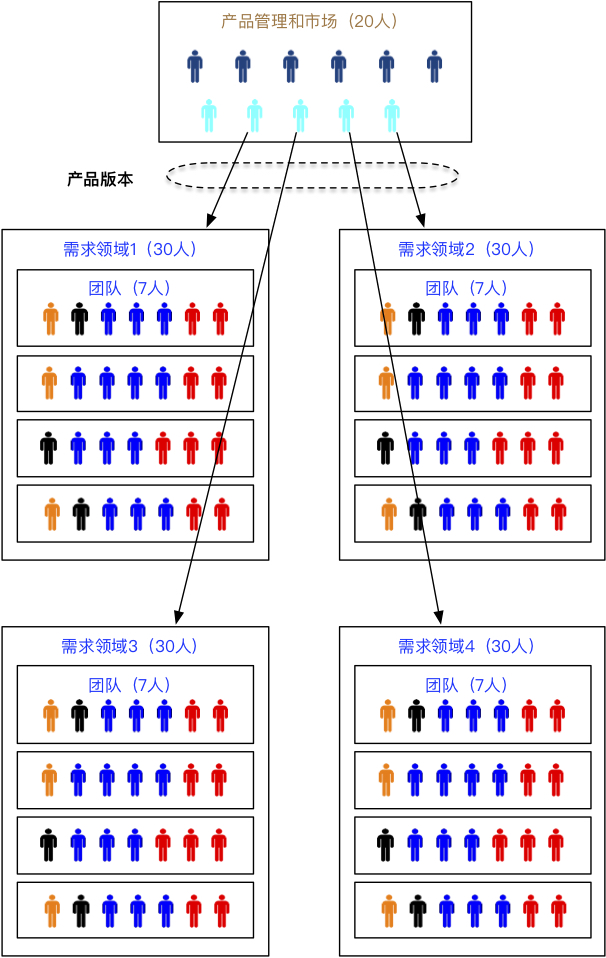

# 第一章 组织设计

这里的产品开发组织是指一群人以某种结构和流程组织在一起开发一个产品。定义什么样的结构和角色和采用什么样的流程就是组织设计，而组织设计实质上是针对系统目标的一系列选择。

有这样一个产品开发组织，大约150人，包含了产品和研发。这可能是一个公司，也可能是公司内的一个事业部，它能直接面向客户和对损益负责。对客户而言，他们购买使用这个组织开发的产品，并且只有一个产品。组织里所有人的工作都与这个产品相关。我们来看一下传统和敏捷两种思路下的产品开发组织分别会如何设计。

## 1. 传统产品开发组织

矩阵型组织是一种常见的传统产品开发组织。

**矩阵型组织**

产品包括产品经理和市场；研发由项目管理部门和研发职能部门组成。项目管理部门里主要是项目经理。研发职能部门包括业务分析、架构设计、开发和测试，各部门由职能经理负责。开发和测试进一步分为若干小组，开发以技术领域分小组，包括前端、后端和平台；测试以业务领域分小组。每个小组由TL（Team Leader）负责小组的绩效。

产品管理：产品经理根据客户和市场的输入形成需求，并把需求规划到产品版本。基于版本，产品经理输出产品需求规格书。

项目管理：针对某个产品版本的工作被定义为项目（立项），任命项目经理负责项目的交付。项目经理从各职能部门要求资源，涵盖业务分析、架构设计、开发和测试，组成项目组。项目设立里程碑，基于瀑布开发模式，包含需求规格完成、设计完成、编码完成、测试完成，直至版本发布后，项目结束。项目里程碑之间的进度管理基于任务，按周汇报状态。

研发管理：职能经理和TL负责分配成员到不同的项目，优化人员的利用率，同时负责提升成员能力和绩效考核。职能经理和TL对该职能承担的工作质量负责。

我们通常把这样的组织称作矩阵型组织，很多公司都采用类似的组织结构。尽管不同公司对一些角色和对象可能会采用不同的叫法，本质上却是一致的。产品经理定义产品版本，而项目承载了产品版本的交付。项目的管理由项目经理负责，她通过与产品经理、职能经理互相配合和牵制来完成项目的交付。项目和项目经理是该组织中的核心。

**一种设计**

产品开发组织的本质是围绕工作把人员组织起来，以一定的时间点交付产品。这里面有三个主要的方面：工作、人员和时间，我们来看一下矩阵型组织是如何设计的。

工作以项目为基本单位。同时会有多个项目存在；每个项目包含批量需求；项目进一步分解成里程碑和任务，作为项目跟踪的基本工作单位

人员以项目组为基本单位。项目组服务于项目，它的生命周期从立项开始，到结项终止。项目组成员来自不同职能部门，这些成员可能同时工作于多个项目

时间以项目节点为基本单位。项目节点有大有小，大的被称作里程碑，小的则是周报。每个项目有各自独立的节点；组织层面对所有项目定期也会有评审

这种组织的管理是由产品经理、项目经理、职能经理和TL来共同完成的。

这样的组织方式是唯一的设计吗？当然不是，我们来看一下敏捷产品开发组织。

## 2. 敏捷产品开发组织

基于LeSS（Large-Scale Scrum／大规模Scrum）的组织是一种常见的敏捷产品开发组织。

**基于LeSS的组织**

产品还是包括产品经理和市场，但是其中一些人会承担产品负责人的角色。整个产品有一个产品负责人；产品被分成了4个需求领域，每个需求领域各自有一个领域产品负责人，他们一起组成了产品负责人团队。研发有4个部门，分别对应于4个需求领域（LeSS并不建议研发部门对应需求领域，这里只是为了方便比较说明）。每个部门由若干特性团队组成，每个特性团队都跨职能，能完成端到端的需求交付。每个部门有一个研发经理，每个团队有一个SM（ScrumMaster），其中一些SM服务于2-3个团队。特别需要注意的是，在基于LeSS的组织里没有项目管理部门，而是让产品管理和跨职能特性团队直接对接。

产品管理：产品负责人和产品经理根据客户和市场的输入形成需求，由产品负责人统一对需求进行排序，经排序的需求列表叫做产品待办列表。整个产品分为几个需求领域，每个领域都有一个（领域）产品负责人维护一份（领域）产品待办列表。产品开发基于迭代进行，所有团队的迭代周期一致，所有团队的工作在每个迭代都得到集成并产出一个潜在可交付的产品增量。产品负责人团队决定产品版本的范围和发布时间。

项目管理：在这种模式里并没有传统意义上的项目，项目在产品版本和迭代两个层次体现。产品负责人负责管理版本的交付；团队负责管理迭代的交付。版本作为一个“项目”，产品负责人权衡范围（哪些需求）、时间（多少个迭代）和成本（多少个团队）。产品负责人对需求进行优先级排序后，团队在每个迭代开始按优先级计划适量的需求来开发，并在迭代结束时做到完成。迭代作为一个“项目”，团队管理范围（哪些需求和任务），而时间和成本是固定的。若干个迭代后，形成一个产品版本发布。产品一直处在持续开发中。

研发管理：SM和研发经理促进产品负责人和团队的有效协作，团队自身的绩效提升，以及组织的持续改进。团队自组织进行迭代交付，对工作质量负责。

这样的组织是基于LeSS框架设计的。产品负责人持续对需求进行排序以最大化价值，团队按迭代交付最高优先级的需求。需求、迭代和团队是该组织中的核心。

**另一种设计**

还是从工作、人员和时间的方面，我们来看一下基于LeSS的组织是如何设计的。

工作以需求为基本单位。需求排优先级形成一份产品待办列表；每个需求领域有一份（领域）产品待办列表，需求领域内的多个团队都遵循同一个优先级

人员以跨职能的特性团队为基本单位。特性团队是稳定的团队，在相对较长时期（比如一年）工作于一个需求领域；需求领域由若干个特性团队组成，特性团队独立地交付需求领域里的需求

时间以迭代为基本单位。所有团队的迭代都同步，每个迭代以计划开始，以评审回顾结束。每个迭代产生一个潜在可交付的产品增量

这种组织的管理是由产品负责人、自组织团队，以及SM和研发经理来共同完成的。

我们看到相比于矩阵型组织，基于LeSS的组织采用了很不一样的组织设计。

## 3. 组织设计是一系列选择

让我们来对比一下矩阵型组织和基于LeSS的组织在工作、人员和时间方面都采用了哪些不同的组织方式和管理角色。

| | 矩阵型组织 | 基于LeSS的组织 |
|---|---|---|
| **工作** | 项目（批量需求、任务） | 单个需求 |
| **人员** | 项目组 | 特性团队 |
| **时间** | 项目节点（里程碑、周） | 迭代 |
| **管理-产品** | 产品经理 | 产品负责人 |
| **管理-项目** | 项目经理 | 产品负责人、团队 |
| **管理-研发** | 职能经理、TL（Team Leader) | 研发经理、SM（ScrumMaster） |

矩阵型组织和基于LeSS的组织选择了不同的组织方式和管理角色，它们只是实际存在的产品开发组织中的其中两个。实际的产品开发组织有很多变体，归根结底都是在这些方面做了一系列的选择。同属传统产品开发组织或者敏捷产品开发组织的变体之间所作的选择相差小一些，而象矩阵型组织和基于LeSS的组织这样的设计之间选择相差就很大。

我们试着列举围绕这些方面的一系列选择：

* **工作**
    * 批量需求（项目）还是单个需求？
    * 需求还是任务？
    * 一份还是多份产品待办列表？
    * 产品定义是狭窄还是宽泛？
* **人员**
    * 特性组（项目组）还是特性团队？
    * 单一职能团队还是跨职能团队？
    * 组件团队还是特性团队？
    * 专业特性团队还是全面特性团队？
    * 团队的合适规模是多大？
* **时间**
    * 项目周期还是迭代周期？
    * 迭代还是超级迭代？
    * 迭代还是流？
* **管理**
    * 项目经理还是自组织团队？
    * TL（Team Leader）还是SM（ScrumMaster）？
    * TL（Team Leader）还是PO（产品负责人）？
    * 职能/组件经理还是研发经理？
    * 管理团队还是管理组？

无论是有意识的还是无意识的，这一系列的选择都构成了当前的产品开发组织，影响甚至决定了该组织的优势和弱点。不同的组织有不同的目的，产品开发组织存在的最重要目的是交付成功的产品。产品开发的最大挑战是应对不确定性，无论是来自市场的还是技术的，因此速度和灵活性至关重要。如果把产品开发组织看成一个系统，速度和灵活性就是这个组织的系统目标。不幸的是，我们的选择未必都在优化这个系统目标，并且我们在背道而驰的时候往往还没有意识到。

这本书的目的是希望对这些选择背后的因素和动态加以分析，从而帮助大家在设计大规模产品开发组织时根据当下做有意识的选择，并随着当下的改变调整这些选择。本书的结构如下：

**第一部分 引言**

这一部分由两个章节组成，分别介绍组织设计和系统思考，为用系统思考指导组织设计打下基础。

第一章 [组织设计](../Chapter1/OrganizationalDesign.md)（也就是本章）引入组织设计作为一系列选择的视角。我们描述了两种常见组织背后涉及的不同选择，并解释了产品开发组织所需要优化的系统目标。

第二章 [系统思考](../Chapter2/SystemsThinking.md)介绍系统思考和常用的系统建模工具CLD（Causal-Loop Diagram，因果回路图）。组织设计的一系列选择都涉及复杂的系统动态，而系统思考很适合分析这样具有动态复杂性的问题，CLD会是我们后续章节使用的分析工具。

**第二部分 组织设计**

这一部分由五个章节组成，首先把项目作为一种单独的组织设计选择加以分析，然后分别阐述围绕工作、人员、时间和管理四个方面的设计选择。

第三章 [项目作为一种组织设计选择](../Chapter3/ProjectAsAnOrganizationalDesignChoice.md)从工作、人员、时间和管理四个方面各自选取了一对选项来分析项目这一组织设计选择背后的因素和动态。

第四章 [工作设计选择](../Chapter4/WorkDesignChoices.md)分析工作设计选择背后的因素和动态，包括项目还是需求、需求还是任务、一份还是多份产品待办列表、产品定义是狭窄还是宽泛等。

第五章 [人员设计选择](../Chapter5/PeopleDesignChoices.md)分析人员设计选择背后的因素和动态，包括特性组还是特性团队、单一职能团队还是跨职能团队、组件团队还是特性团队、专业特性团队还是全面特性团队、团队的合适规模是多大等。

第六章 [时间设计选择](../Chapter6/TimeDesignChoices.md)分析时间设计选择背后的因素和动态，包括项目周期还是迭代周期、迭代还是超级迭代、迭代还是流等。

第七章 [管理设计选择](../Chapter7/ManagementDesignChoices.md)分析管理设计选择背后的因素和动态，包括项目经理还是自组织团队、TL还是SM、TL还是PO、职能/组件经理还是研发经理、管理团队还是管理组等。

**第三部分 组织变革**

这一部分由两个章节组成，分别阐述组织变革相关的基本系统动态和组织变革时机和范围的选择。

第八章 [理解组织变革](../Chapter8/UnderstandOrganizationalChange.md)认识组织变革相关的基本系统动态，充分理解变革中的平衡回路，并通过提升目标形成持续改进的增强回路；看到局部优化和短期优化，并通过系统优化目标和变革愿景来拉动全局优化和长期优化。

第九章 [实施组织变革](../Chapter9/ImplementOrganizationalChange.md)分析组织变革的时机和范围。认识组织增长动态背后的增强回路有助于我们抓住组织变革的最好时机，以及打破增强回路并逆转原有趋势的关键杠杆。大规模组织变革的范围选择至关重要，我们分享如何选择合适的变革初始范围，以及增量式结构变革的思路。

**第四部分 结论**

这一部分由两个章节组成，包括若干组织设计和变革的实战案例，以及建立大规模产品开发组织设计和变革“取舍曲线”的倡议。

第十章 [组织设计和变革实战](../Chapter10/OrganizationalDesignAndChangeInTheField.md)介绍若干组织设计和变革的实战案例，结合第二和第三部分的系统思考分析来呈现其中包含的一系列选择。

第十一章【待定】介绍精益产品开发中的“取舍曲线”工具，本书试图启动建立大规模产品开发组织设计和变革的“取舍曲线”，帮助大家理解不同选择背后的因素和动态，持续结合当下，做出有意识的选择。
