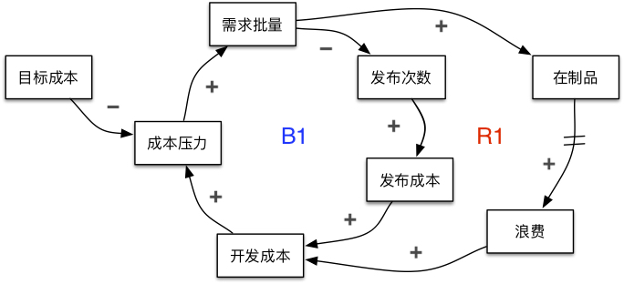
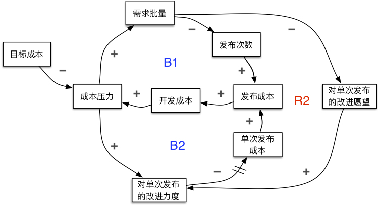
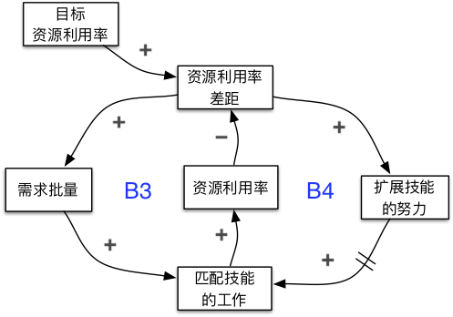
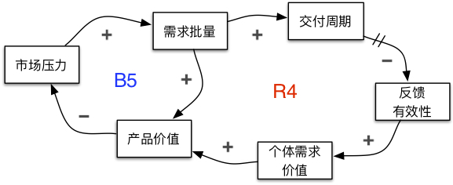
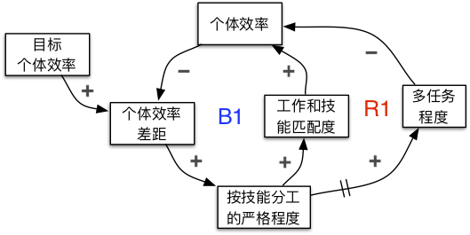
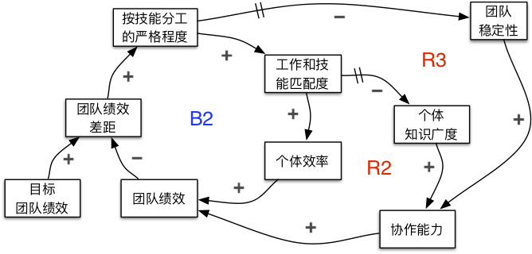
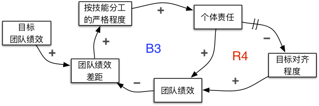
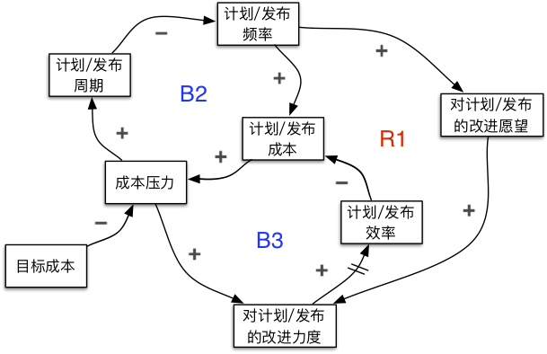
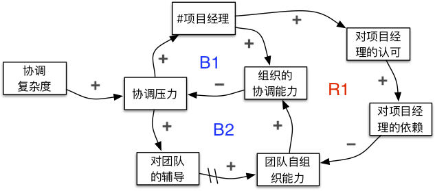
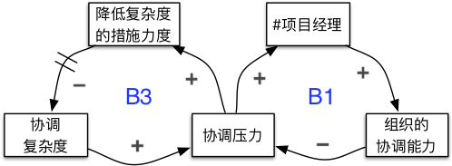

#第三章 项目作为一种组织设计选择

项目作为一种组织设计在很多产品开发公司都存在。项目是一个多方面的概念，它指的可以是工作、人员、时间和管理方式。在这个章节中，我们把项目作为一种组织设计选择进行分解，从各个方面分析不同的选项，并用系统思考来分析背后的因素和动态。

从工作方面看，项目作为工作单元包含了批量需求，另一种选择是以个体需求为工作单元。从人员方面看，项目是围绕工作来创建项目组，另一种选择是由特性团队来完成工作。从时间方面看，项目周期是批量需求交付的周期，另一种选择是以迭代为周期完成一部分需求的交付。从管理方面看，项目由项目经理协调工作，另一种选择是由团队自组织协调工作。

##1. 项目（批量需求）还是个体需求？

从工作方面来说，我们可以一批批地做需求，也可以一个个地做需求。项目伴随着批量需求，它这样做有一系列原因，同时也带来一系列问题。项目还是需求这一选择背后的本质是需求批量的大小，从个体需求到批量需求，需求批量是我们分析这组选择的核心变量。接下来我们从开发成本、资源利用、交付周期和产品价值四个方面来分析。

###1.1 开发成本

影响开发成本的因素有很多，其中包含发布成本和浪费，大致上分别对应于Donald Reinertsen在《The Principles of Product Development Flow》书中提到的交易成本和持有成本，实际上多数公司计算的开发成本比书中所说的总体成本范围要小，但不影响我们定性分析的结果。

**回路B1**：批量需求发布以降低成本

成本压力是批量需求交付的一个常见原因。有些发布成本与需求批量大小关系不大，近乎固定成本，比如回归测试和部署。需求批量越大，发布次数越少，发布成本越低。这进而降低开发成本，成本压力得到缓解。

**回路R1**：批量需求带来的浪费

批量需求带来了更多在制品，由此产生更多浪费，反而增加了开发成本。成本压力继续变大，导致继续增加需求批量。这里的浪费指的是需求没有及时得到反馈（比如集成、测试、用户反馈），频繁的上下文切换和重新学习等。回路B1和R1形成了“饮鸩止渴”系统基模的动态。

**回路B2**：改进单次发布以降低成本

单次发布成本并不是一成不变的，比如回归测试的成本在引入自动化后有可能大幅降低，从而使得为更小批量需求做回归测试从成本上来说变得可以接受。相对于回路B1中以批量需求来分摊发布成本，回路B2的解决方案更为根本，但同时也需要更长时间才能见效。

**回路R2**：改进单次发布的愿望不足

回路B1和回路B2都能降低发布成本从而缓解成本压力，两者互动形成了有趣的动态。当以批量需求为单位进行发布时，对单次发布的改进愿望也就不那么强烈了，从而减少了这方面的改进力度，使得单次发布成本居高不下，反过来又成了支持批量需求发布的论据。回路B1、回路B2和回路R2形成了“舍本逐末”系统基模的动态。

###1.2 资源利用

**回路B3**：批量需求提升资源利用率

提升资源利用率是另一个做批量需求的原因。当只做个体需求时，对某个专业个人或者小组来说匹配自己技能的工作可能不够，导致资源利用率低。通过同时做批量需求，有些需求要求某个专业技能多些，有些则少些，叠加起来使得整体的资源利用率得到提升。

**回路B4**：扩展技能提升资源利用率

把人叫做资源其实是个很大的误区，人和资源最大的不同是人可以通过学习扩展技能。技能的扩展使得匹配技能的工作变多，从而提升资源利用率。然而技能的扩展通常也需要更长时间，这样一来回路B3和回路B4就形成了“目标侵蚀”系统基模的动态，回路B3往往占据主导。

###1.3 交付周期

回路B1“批量需求发布以降低成本”带来了对交付周期的负面影响。收到批量需求通常也意味着会同时开始做，这形成了更多的在制品，从而导致交付周期变长。

**回路R3**：周期越长变更越多

更为糟糕的是更长的交付周期带来更多的需求变更，需求变更又使得批量需求进一步增加，从而形成恶性循环。

为了追求降低成本我们增加需求批量，这使得交付周期越来越长。我们的系统优化目标是降低成本还是缩短交付周期？如果是交付周期，成本就应该只是次要关注，我们不应该通过牺牲交付周期去满足成本要求。事实上，B2回路“改进单次发布以降低成本”才是我们应该努力的方向。

###1.4 产品价值

**回路B5**：批量需求以提升产品价值

为了应对市场压力，我们增加交付的需求批量，从而提升产品价值，使得市场压力得以减轻。

**回路R4**：缺乏有效反馈降低个体需求价值

当试图通过增加需求批量以提升产品价值时，交付周期延长，使得反馈有效性降低，导致个体需求价值降低，这种低效的产品探索又需要增加需求批量来弥补。回路B5和回路R4形成了“饮鸩止渴”系统基模的动态。

##2. 项目（特性组）还是特性团队？

从人员方面来说，特性组是为了交付某个特性由具有匹配技能的人员组成的临时组（这种组织方式在传统的矩阵结构中很常见，也被叫做特性项目）；而特性团队是稳定的团队，承担共享责任来交付一个又一个的特性。下表出自[特性团队简章](http://www.featureteams.org/feature_team_primer12.pdf)，总结了两者之间的主要不同。

| 项目 / 特性组 | 特性团队 |
|---|---|
| 临时的项目组，为一个特性或者项目创建 | 稳定的团队，会在一起几年，工作在很多特性上 |
| 个人对自己的专项负责 | 对所有工作共享团队责任 |
| 项目经理控制 | 自管理团队 |
| 矩阵组织（资源池） | 简单的单一直线组织（没有矩阵） |
| 团队成员因为专业化而兼职工作在多个项目上 | 团队成员100%专职工作在某个团队 |

###2.1 个体效率

**回路B1**：工作匹配技能以提升个体效率

追求个体效率是采用特性组的一个重要原因。建立特性组时会严格要求专业人员只做自己领域的工作，使得工作和技能的匹配度很高，从而带来个体效率的提升。

**回路R1**：多任务降低个体效率

严格按专业技能分工加上每个人的利用率需要得到保证，两者结合就形成了一个人同时工作在多个需求甚至属于多个特性组的情况，导致人员来回切换工作，这种多任务处理反而降低了个体效率。回路B1和R1形成了“饮鸩止渴”系统基模的动态。

###2.2 团队绩效

**回路B2**：工作匹配技能以提升团队绩效

这其实是回路B1“工作匹配技能以提升个体效率”的扩展，团队绩效随着个体效率的提高而提高。

**回路R2**：知识广度不足降低团队协作水平

工作和技能的匹配度高使得团队成员很少有机会拓展学习，长此以往造成每个人的知识广度不足，彼此之间不了解对方的工作，从而导致协作水平低下，影响团队绩效。回路B2和R2形成了“饮鸩止渴”系统基模的动态。

**回路R3**：团队不稳定降低团队协作水平

不同的需求要求的技能分布不同，这导致了围绕需求所创建的特性组会是动态的，团队稳定性低使得默契难以形成，改进效果难以维持，因此团队协作能力难以提升，低下的协作能力进而影响团队绩效。回路B2和R3同样形成了“饮鸩止渴”系统基模的动态。

**回路B3**：加强个体责任提升团队绩效

按技能分工清晰地定义了个人的工作范围，使得个体责任得到加强，进而提升了团队绩效。

**回路R4**：目标不对齐降低团队绩效

强调个体责任感导致团队成员的目标缺乏对齐，反而降低了团队绩效。回路B3和R4也形成了“饮鸩止渴”系统基模的动态。

##3. 项目（周期）还是迭代？

从时间方面来说，项目周期通常既是计划周期又是发布周期；迭代是固定长度的时间周期，通常也既是计划周期又是发布周期。实际中迭代和发布周期并没有强绑定，也就是可能几个迭代发布一次，也可能一个迭代发布多次。无论从计划还是发布的角度来看，迭代相比传统的项目周期都更短。计划周期和发布周期分别是两个变量，长的是项目，短的是迭代。

**回路B1**：市场变化需要缩短计划/发布周期

市场变化带来市场压力，驱使我们缩短计划/发布周期，以增加灵活性，也就是响应变化的能力。灵活性提升，市场压力得到缓解。

**回路B2**：计划/发布周期的缩短受限于计划/发布成本

计划/发布周期的缩短提高了计划/发布的频率，从而增加了计划/发布的成本，带来了成本压力，最终限制了计划/发布周期的缩短。

如果计划/发布的成本是一成不变的，我们必须在灵活性和成本的目标之间有所选择。好在我们可以通过改进计划/发布效率来降低计划/发布成本。

**回路B2**：延长周期以降低计划/发布成本

其实这就是之前“计划/发布周期的缩短受限于计划/发布成本”的回路，只是这里的角度稍有不同。延长周期从而降低频率也可以看作是降低成本的解决方案。

**回路B3**：改进效率以降低计划/发布成本

改进计划/发布效率是另一个解决方案。我们需要进一步阐述都有哪些计划和发布成本可能通过改进效率来降低。

* 计划成本

计划一方面是与产品业务方的对齐，另一方面是与不同研发部门的对齐。当产品业务方基于批量思维建立了重量级的评审流程时，更频繁的计划意味着更高的成本。当研发组织结构基于职能和组件时，多个部门需要计划同步才能交付产品，更频繁的计划也意味着更高的成本。相应地，降低计划成本的改进包括简化项目计划评审流程（比如采用产品待办列表）、简化项目组创建流程（比如创建长期稳定的特性团队）等。当然这些改进都需要时间，因此是长期的解决方案。

* 发布成本

关于发布成本我们已经在本章第1节“项目还是需求？”中开发成本的部分进行了阐述。

**回路R1**：改进计划/发布效率的愿望不足

回路B2和回路B3都能降低成本，两者互动形成了有趣的动态。当以项目周期进行计划/发布时，改进计划/发布效率的愿望也就不那么强烈了，从而减少了这方面的改进力度，使得计划/发布效率持续低下，反过来又成了支持以项目周期进行计划/发布的论据。回路B2、回路B3和回路R1形成了“舍本逐末”系统基模的动态。

##4. 项目经理还是自组织团队？

从管理方面来说，在传统的项目中，项目经理组织协调相关人员一起完成项目交付；而在敏捷产品开发中，自组织团队自身承担了组织协调工作。

**回路B1**：项目经理协调

协调压力来自于协调复杂度和组织的协调能力之间的差距。为了增加协调能力，最直接的办法是增加项目经理的数量（#项目经理）。因此协调能力得以加强，协调压力得到缓解。

**回路B2**：自组织团队协调

增加组织的协调能力的另一个办法是提升团队自组织能力。通过加强对团队的辅导，而不是替团队协调，团队自组织能力提升，组织的协调能力也能加强，从而协调压力得到缓解。辅导团队带来能力提升通常需要时间，所以这是更为长期的解决方案。

**回路R1**：对项目经理的依赖

增加项目经理能很快见效，大家对项目经理的认可度提高，对他们的依赖也在增加，最终影响了团队自组织能力的提升，反过来又成了增加项目经理的论据。回路B1、回路B2和回路R1形成了“舍本逐末”系统基模的动态。

**回路B3**：降低协调复杂度

缓解协调压力也可以从降低协调复杂度着手。比如说特性团队的建立就能大大减少协调复杂度，因为之前需要跨部门协调的事变成了可以在特性团队内部协调解决。然而这类措施通常需要更长时间，这样一来回路B1和回路B3就形成了“目标侵蚀”系统基模的动态，回路B1往往占据主导。

##总结

项目的模式作为一种组织设计在工作、人员、时间和管理几个方面分别选择了批量需求、特性组、项目周期和项目经理，与此不同的另一组选择则形成了持续产品开发的模式，也就是创建产品待办列表对需求进行优先级排序、创建特性团队、按迭代自组织交付。

| | 项目 | 持续产品开发 |
|---|---|---|
| **工作** | 批量需求 | 个体需求 |
| **人员** | 特性组 | 特性团队 |
| **时间** | 项目周期 | 迭代周期 |
| **管理** | 项目经理 | 自组织团队 |

我们来总结一下两种选择背后优化的系统目标和心智模式（根本假设）的不同。

* 系统目标

项目模式围绕效率、成本、资源利用率进行优化，而持续产品开发模式没有把优化这些目标作为第一考虑。持续产品开发模式认为这些目标可以通过学习和改进进行优化，长期来说也可以兼顾。

持续产品开发模式围绕速度、灵活性、产品价值进行优化，而项目模式经常在优化效率、成本、资源利用率的同时损害了这些目标。

* 心智模式

项目模式认为聚焦于个体效率和个体责任，由项目经理管理团队是有效的方式，而持续产品开发模式认为聚焦于团队协作和共享责任，由团队自组织是更有效的方式。

项目模式背后有明显的资源思维，也就是把人当作资源。基于的根本假设有：人的技能是静态的，学习是对效率的损害，多任务能提升人员的利用率，成员临时组合就能有效协作，需要专门角色来协调工作。

本章对项目模式和持续产品开发模式所做的不同组织设计选择逐项进行了基于CLD的分析，是典型的慢思考（参见丹尼尔·卡尼曼的《思考，快与慢》）。将因果以变量和链路的方式呈现出来，对其应用批判性思考推理论证，我们由此深入到组织设计的本质。