#第四章 工作设计选择

项目是一个多方面的概念，它可以指关于工作、人员、时间和管理的组织设计方式。我们在第三章中专门就项目的这些方面探讨了可能的其它选择，分析了不同选择背后的因素和动态。在接下来的四个章节中，我们会就工作、人员、时间和管理方式这四个方面其它的设计选择进行探讨分析。本章专注于工作相关的设计选择。

##1. 项目还是需求？

项目在工作方面就是批量需求，批量需求还是个体需求的选择我们已经在第三章第1节中阐述。

##2. 需求还是任务？

传统的项目在两个层次跟踪进度。一个是里程碑，经常跟诸如需求分析完、集成准备就绪、测试完成这样的阶段相关联。另一个是任务状态，经常通过每周汇报会议来跟踪。相比之下，敏捷开发却跟踪需求交付的状态（注：更好的是跟踪需求背后价值交付的状态，但这不在本节范围内讨论），而在辅导敏捷团队时一个重要的杠杆点就是增加对需求而非任务的聚焦。让我们来看不同选择背后的动态。

###2.1 聚焦任务和聚焦需求背后的原因

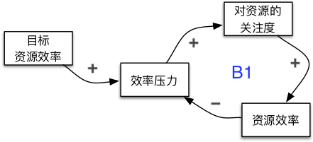

**回路B1**：关注资源减轻效率压力

这里的资源效率其实就是资源利用率，因为考虑到与流动效率的说法相对应，所以在本节中将其称为资源效率。聚焦任务反映了对资源效率的关注度。当面临效率压力时，我们尝试增加对资源的关注度，以提高资源效率，从而减轻效率压力。

聚焦任务意味着跟踪任务和人。事实上当跟踪任务时，次序经常是按人，问每个人在做什么任务，以确保每个人都忙着，没有资源空闲。当没有匹配他们技能的任务时，就创造任务，比如通过开启另一个需求，其中包含匹配他们技能的任务。我们会在后面看到这将带来有趣的影响。

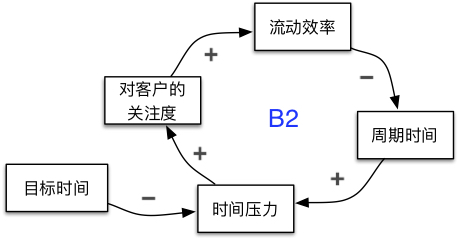

**回路B2**：关注客户减轻时间压力

聚焦需求则反映了对客户的关注度。当面临上市时间压力时，我们尝试增加对客户的关注度，以提高流动效率，缩短周期时间，从而减轻时间压力。

聚焦需求意味着我们不是跟踪任务和人，而是跟踪需求确保它们流动。我们较少关注谁闲着，也就是资源效率，更多关注如何让需求流动得顺畅。

###2.2 资源效率和流动效率之间的矛盾

如果两个平衡回路相互独立，效率和时间的目标可以同时得到满足。然而，在资源效率和流动效率之间存在矛盾。

我们讨论资源效率时曾经提及，当一个需求对某些人来说没有他合适的任务时，我们就开启另一个需求以使他有合适的任务做，从而提高了资源效率。但是这样做增加了在制品，因此降低了流动效率。而当我们聚焦客户价值追求流动效率时，却会限制并行工作的需求个数，也就是减少在制品。这不可避免会产生某些人没有合适的任务做的情况，从而降低了资源效率。

现在两个平衡回路就相互作用了。当时间压力变大时，减少在制品以提高流动效率；而在制品的减少降低了资源效率。这时候是回路B2主导。当效率压力变大时，增加在制品以提高资源效率；而在制品的增加降低了流动效率。这时候是回路B1主导。

理解这个矛盾帮助我们以不同的方式看待变革中的阻力。虽然聚焦客户令人难以反驳，根本性的系统结构却产生反向的力量。这个矛盾也提出了关于系统目标的重要问题。对特定的组织来说，你更想优化哪个目标 - 资源效率还是流动效率？

###2.3 产生影响的杠杆

有可能两者兼得吗？或者至少在以某一项为主的同时能兼顾另一项？

**回路B1**：关注资源减轻效率压力

我们开始并行更多需求以匹配具备的技能，从而提高资源效率，但这以牺牲流动效率为代价。

**回路B3**：学习扩展技能以提高资源效率

我们还能通过学习以增加技能广度，从而提高资源效率。这样就不会对流动效率有负面影响，但学习也需要更长时间才见效。不令人意外的是，真正的杠杆点在于如何能有效地学习和扩展技能。

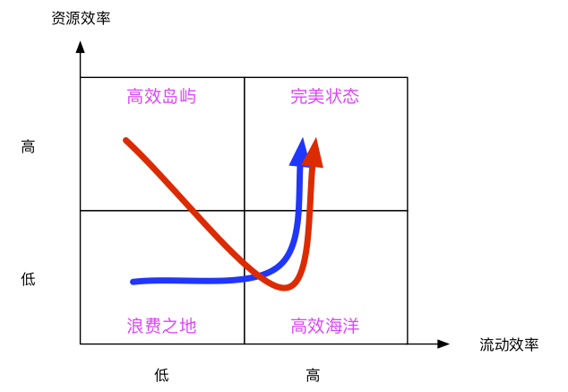

上图是来自于[《This is Lean》](https://www.amazon.com/This-Lean-Resolving-Efficiency-Paradox/dp/919803930X)书中的效率矩阵。图中的蓝线表示通往“完美状态”的演进路径，首先实现回路B2（提高流动效率），然后再是回路B3（提高资源效率）。然而很多组织自认为它们的现状是“高效岛屿”，也就是回路B1主导，这样一来演进路径变成了图中的红线。从变革管理的角度来看，沿红线演进是困难的，因为它意味着资源效率会先降低。你可以改变认知以从更为真实的“浪费之地”出发，或者确保资源效率的降低是可以掌控的。

聚焦需求还是聚焦任务本质上是关注客户价值还是关注资源利用率的选择。

##3. 一份还是多份产品待办列表？

产品待办列表包含了团队的所有工作。当有多个团队工作于同一产品时，是每个团队有一份自己的产品待办列表，也就是有多份产品待办列表；还是多个团队共享一份产品待办列表？产品待办列表份数是我们分析这组选择的核心变量。

###3.1 全局优化价值

因为是一个产品，我们希望最大化产品的整体价值。产品待办列表定义了价值优化的范围，同一份列表里的需求统一进行优先级排序，而不同份列表里的需求则各自进行优先级排序。

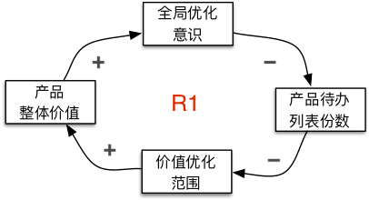

**回路R1**：统一优先级排序最大化产品整体价值

当我们减少产品待办列表份数时，优先级排序的范围变大，这样就更能全局优化，从而提高产品整体价值。由此提升的全局优化意识，又能促进进一步减少产品待办列表份数。

当一个产品只有一份产品待办列表时，我们可以做到产品范围内全局优化价值。

###3.2 团队灵活性

实现全局优化价值的一个限制来自于团队灵活性，也就是可以灵活地工作在任何需求上的能力。

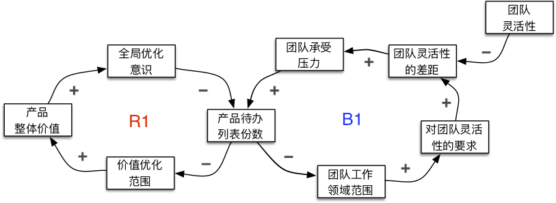

**回路B1**：团队灵活性限制全局优化价值

当整个产品只有一份产品待办列表时，团队工作领域的范围最大，也就是整个产品。这对团队灵活性的要求也是最高的，由此带来最大差距，使得团队承受最大压力，从而增加产品待办列表的份数。

回路R1和B1一起形成了“成长上限”系统基模的动态。价值优化是我们希望发生的增强回路，而它受到团队灵活性的限制。

对回路B1的另一个解读是，多份产品待办列表意味着团队可以在较小领域工作，因此对灵活性的要求得以降低。这是一个缩小差距的解决方案，那么有没有其它方案呢？

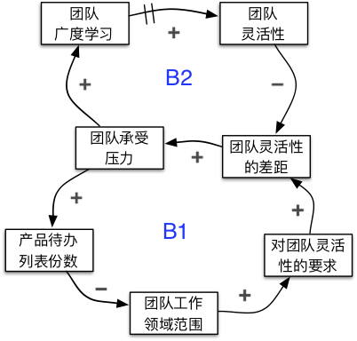

**回路B2**：团队广度学习提高灵活性

当因为不够灵活而承受更多压力时，我们还可以加强团队的广度学习，一段时间后团队的灵活性也将得到提高。

回路B2就是另一个解决方案，广度学习带来灵活性提升需要时间，因此它和回路B1在一起作用时形成了“目标侵蚀”系统基模的动态。实际中我们容易陷在回路B1里，从而限制了全局优化价值。

###3.3 需求澄清

很多人认为是PO来澄清需求，这其实是个误解。Scrum定义由PO负责优先级排序以最大化价值，而需求澄清可以由PO和团队共同完成。这个误解带来了一个其实不必要的限制，也就是PO的需求澄清产能。

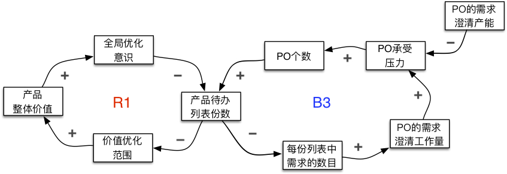

**回路B3**：PO需求澄清产能限制全局优化价值

当整个产品只有一份产品待办列表时，这份列表中需求的数目是最多的，也就是包含了整个产品所有的需求。这带来了最多的需求澄清工作量，使得PO承受最大压力，因此我们引入更多PO以分担需求澄清工作量。引入的PO其实不是真正的PO，而是类似BA（Business Analyst/业务分析师）的角色。多个PO又带来了多份产品待办列表。

对回路B3的另一个解读是，为了减轻PO在需求澄清上的压力，我们增加更多PO，多个PO带来多份产品待办列表，每份产品待办列表中的需求数目因此减少，使得PO澄清需求的工作量降低，PO的压力得以释放。引入多个PO来分担是解决PO需求澄清工作量过大的一个解决方案，那么有没有其它方案呢？

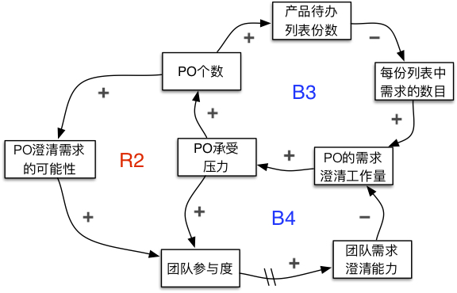

**回路B4**：团队参与分担需求澄清工作量

为了减轻PO需求澄清工作量过大所带来的压力，我们还可以提高团队在需求澄清上的参与度。一段时间后，团队提升了需求澄清的能力，从而能够承担更多相关工作，使得PO在澄清需求上的工作量得以减轻。

**回路R2**：团队参与机会不足

回路B3和B4都能帮助降低PO澄清需求的工作量，然而增加PO使得更可能是PO在澄清需求，而减少了团队参与的机会，导致团队需求澄清能力无法提升以帮助PO分担工作，从而使PO工作量过大的问题只能通过增加PO来解决。回路B3、B4和R2形成了“舍本逐末”系统基模的动态。尽管回路B4是更根本的解决方案，但是由于它需要更长时间才能见效，实际中我们容易陷在回路B3里，从而不必要地限制了全局优化价值。

---

采用多份产品待办列表意味着无法在整个产品范围内最大化价值排序。采用一份产品待办列表的关键在于提升团队灵活性，并且构建需求澄清的能力。

##4. 产品定义是狭窄还是宽泛？平台化

什么是产品？这是一个组织设计中的关键问题。你可以狭窄或者宽泛地定义产品，由此产生的产品范围是一个连续体。我们将在接下来的三个部分来认识不同选择背后的因素和动态。在第一部分（第4节），我们会分析将平台定义为产品的情况；在第二部分（第5节），我们会分析将解决方案定义为产品的情况；在第三部分（第6节），我们会分析将产品系列定义为产品的情况。

平台是个在很多产品组织里都很流行的概念。平台经常被当作产品来对待，对应到组织，围绕它有相应的产品待办列表和团队。在多数情况下，平台不面对外部客户，因此本质上还是组件。平台和应用一起形成一个产品，这种情况呈现在上图的左半部分。在有些情况下，平台有独立于应用的外部客户，因此确实是产品。平台和应用就是两个面向不同客户的产品，这种情况呈现在上图的右半部分。让我们分别来展开。

###4.1 平台是一个组件

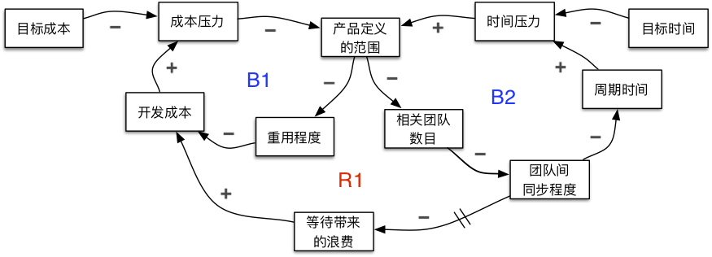

**回路B1**：平台重用降低成本

为什么组织选择把平台定义为产品，即使它本质上只是一个组件？为了重用 - 多个应用可以重用同一个平台，从而节省开发成本。目标是达到成本预算；行动是定义狭窄的产品，也就是平台，来推广重用。背后的推理是平台提升了重用程度，因此降低了开发成本，从而减轻成本压力。

**回路B2**：平台依赖延迟交付

为什么组织不选择把平台定义为产品？当定义了更小的平台后，客户价值的交付会牵扯更多的平台，也就是增加了交付特性所相关的团队数目。由此导致团队间同步程度越来越低，从而周期时间越来越长。这带来了时间压力，形成了对把更多平台定义为产品的抑制力。归根结底这是个在某个时期哪个平衡回路占据主导的问题，它又是否跟我们的系统目标相符？

**回路R1**：不同步带来意外的成本增加

让这变得更为有趣的是，异步性带来了等待，由此产生浪费，反而增加了开发成本。这样就形成了一个增强回路R1。回路B1和R1一起形成了“饮鸩止渴”系统基模的动态。当回路B1主导时，回路R1处在恶性循环中，从而伤害了达到成本预算的目标。当回路B2主导时，回路R1处在良性循环中，不仅对时间目标有利，还能帮助达到成本预算。

回到重用的初衷，有什么其它办法能增加重用程度？内部开源是一种方式。采用它最大的挑战来自于其自然发展的本质 - 只能培育它而不能控制它。

###4.2 平台是一个产品

当平台除了内部应用之外也面向外部客户时，它确实是一个产品，这时就涉及不同的权衡了。

**回路B3**：缩小产品定义推动产品化

在这种情况下，把平台定义为产品主要的驱动力就不在于开发成本了，而是需要将产品带入市场所需要的聚焦和支持。产品化的支持包括市场、销售、预算等。一旦这方面有差距，我们把平台定义为与应用产品独立的产品。这增加了产品导向，带来更好的产品化支持，最终关闭这方面的差距。

**回路B2**：平台依赖延迟交付

但是，这同时会对应用产品带来影响。当平台自主运作后，来自应用的需求就更难同步响应了。平台定义得越小，交付应用需求所相关的平台团队数目就越多，团队间同步程度就越低，交付的周期时间因此变长，导致时间压力变大。这就是之前的回路B2，它对把更多平台定义为产品形成了一种抑制力。

在现实中，平台产品更多是涌现出来，而不是被正确地预先定义出来。我见过很多平台从未变成真正的产品；那些成为真正产品的平台却很少是被预先定义的。和重用组件一样，平台产品的涌现最好也是被培育而非计划。当过早把平台定义为产品时，它损害了应用产品的交付，同时也没能在做出成功的平台产品方面达到预期效果。

##5. 产品定义是狭窄还是宽泛？解决方案

解决方案包括若干产品，这些产品确实都有客户视角，但它们之间需要协作才能产生客户价值。让我们来看两个例子。在电信网络中，无线接入网整体对于客户来说是一个解决方案，而基站和基站控制器是其中独立的产品，也就是解决方案中的网络单元。在电子商务中，电子商务平台给客户提供了端到端的解决方案，而购物、支付、物流是其中独立的产品，也就是整体解决方案中的元素。解决方案往往会演进成一个开发的生态系统。我们可以把解决方案重新定义为产品，那样在同一解决方案中的产品就变成了产品领域。

###5.1 产品化、同步和灵活性

虽然在解决方案中产品之间的关系与第4节中阐述的应用产品和平台产品之间的关系有所不同，以下呈现的动态却很相似。

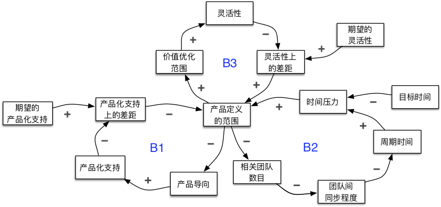

**回路B1**：缩小产品定义推动产品化

产品化是推动狭窄产品定义的一个关键驱动力。产品化的支持包括市场、销售、预算等。一旦这方面有差距，我们把原本只是属于同一产品的不同领域定义为独立的产品。这增加了产品导向，带来更好的产品化支持，最终关闭这方面的差距。

**回路B2**：产品间依赖延迟交付

为了在解决方案层面交付价值，相关的部分必须同步起来。相关独立产品团队越多，团队间同步程度越低，从而延长了价值交付的周期时间。更长的周期时间带来时间上的压力，它形成了对产品独立和狭窄产品定义的制约。

**回路B3**：产品间壁垒降低灵活性

独立产品在自身范围内优化价值，这降低了解决方案整体的灵活性。当一个产品有很多高价值的工作时，是很难从其它产品调动团队进行支援的。当整个解决方案还是充满不确定性，并且整个组织的规模还较小时，我们会期望有更高的灵活性。因此，它也形成了对产品独立和狭窄产品定义的制约。

与把平台产品化类似，在解决方案中形成独立的产品也最好通过涌现而非事先计划的方式。过早的产品独立带来的问题比它解决的问题还更多些。

###5.2 局部创新和整体创新

局部创新和整体创新是另一对权衡。局部创新指的是在每一个狭窄产品内的创新，而整体创新指的是在解决方案层面的创新。

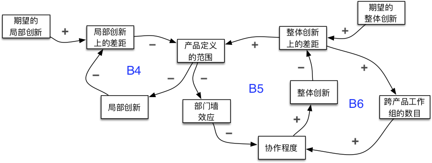

**回路B4**：缩小产品定义推动局部创新

狭窄产品定义通过聚焦帮助推动局部创新，这是狭窄产品定义的驱动力。

**回路B5**：扩大产品定义推动全局创新

然而，产品独立产生部门墙效应，从而损害了同一解决方案中的产品间协作，降低了整体创新。当感知到整体创新不足时，我们可以通过定义宽泛的产品来降低部门墙效应，增进协作，从而提升整体创新。这形成了对狭窄产品定义的制约。

**回路B6**：跨产品工作组推动全局创新

也有组织选择不同的方式来应对整体创新的不足。他们不是通过宽泛产品定义，而是通过创建跨产品的工作组来提升协作，以推动整体创新。理论上来说这是个好主意，然而实践中把那些工作组的创新结果落实到各自独立的产品中是一个挑战。定义宽泛产品和创建工作组也是可以互补的。

##6. 产品定义是狭窄还是宽泛？产品系列

产品系列包括若干服务于同一市场但不同客户群的产品，比如一些是高端的，另一些是低端的。这些产品都有客户视角，通常它们也会共享大部分的代码库。我们可以把产品系列重新定义为产品，那样在同一产品系列里的产品就变成了产品领域。

###6.1 关注度和竞争

我们首先来分析与业务和客户相关的动态。对客户的关注度和产品定位的清晰程度都会影响到客户满意度，而这里的竞争是指产品系列内的不同产品之间围绕业务和客户所开展的竞争。

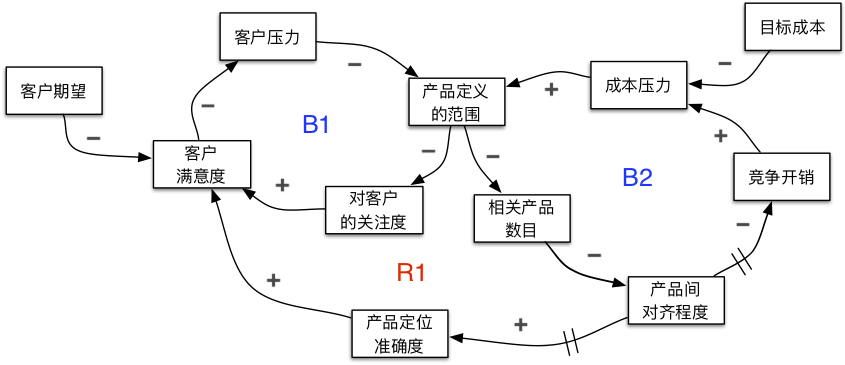

**回路B1**：缩小产品定义增加客户关注度

狭窄产品定义的一个驱动力是更好地服务客户。产品定义得越狭窄，那些对应的客户得到关注越多。这增加了客户满意度，从而客户压力得到释放。

**回路B2**：扩大产品定义抑制不良竞争

狭窄产品定义使得有更多相关产品各自发展，由此产品间对齐程度变弱。因为同属于一个产品系列，这种不对齐导致产品间的竞争加剧，从而开销变大，形成成本压力。这会触发重新定义一个宽泛的产品，从而增加对齐以使竞争可控。这形成了对狭窄产品定义的制约。

**回路R1**：产品定位不准确降低客户满意度

有意思的是当产品间对齐程度降低时，各个产品的定位也变得不够准确。而客户可能使用同一产品系列里的多个产品，这种定位上的模糊甚至冲突会导致客户满意度降低。回路B1和R1一起形成了“饮鸩止渴”系统基模的动态。

###6.2 重复工作和通用组件

让我们再来分析与开发相关的动态。当采用狭窄产品定义时，一个常见的挑战是如何减少各产品之间的重复工作。重复工作对开发成本有负面的影响，而通用组件则能降低成本。

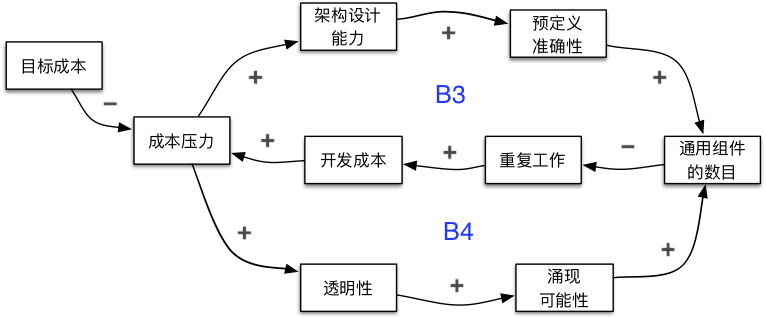

**回路B3**：加强设计以预定义通用组件

产生通用组件的一种方式是通过加强架构设计能力，以更准确地预定义通用组件。与之经常关联的做法是为这些通用组件创建固定的团队。这样一来就形成了我们在第4节中阐述过的“平台是一个组件”的情况。

**回路B4**：增加透明性以涌现通用组件

产生通用组件的另一种方式则是通过增加透明性，比如共享代码，以使通用组件更有可能涌现出来。与之经常关联的做法则是把产品定义得更为宽泛，因为跨产品通常会减弱透明性。

回路B3和B4是创建通用组件的两种不同方式，一种是通过架构设计来预定义它；另一种是通过透明性使它涌现。在我的经验里，预定义的方式只在系统相对简单时才有效；而对于复杂系统来说，涌现通常更为有效。

---

狭窄还是宽泛的产品定义是个很大的话题，有着非常多的上下文差异。在这三节（4、5和6）中，我们涉及的主要权衡和陷阱总结如下：

* 产品化是狭窄产品定义的一个关键驱动力。因为正确的狭窄产品通常是涌现的，我们应当避免过早将它们分离出来。
* 周期时间和灵活性的考虑是对狭窄产品定义的主要制约。无论定义的是真正的产品还是只是平台组件，都是如此。
* 通用组件和重用平台对降低开发成本有利，但并不必要把它们定义为产品并为之建立开发组织。
* 狭窄产品定义推动了局部创新，但同时可能牺牲了整体创新。

##总结

在这一章中，我们探讨了下列几组围绕工作的设计选项：

* 批量需求（项目）还是个体需求？
* 需求还是任务？
* 一份还是多份产品待办列表？
* 产品定义是狭窄还是宽泛？

产品开发组织的系统目标是交付有价值的产品，而选择宽泛的产品定义、采用一份产品待办列表、聚焦需求都在优化该系统目标。诸如资源效率之类的问题应当在不损害系统目标的前提下进行解决，其中一个关键点是团队学习的有效性。
