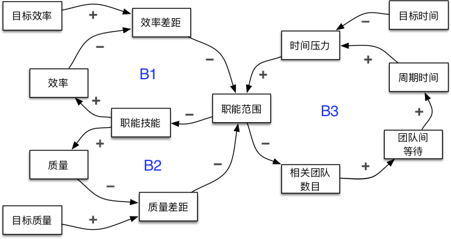
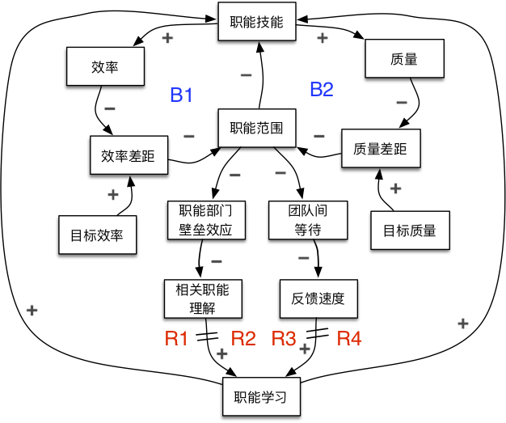
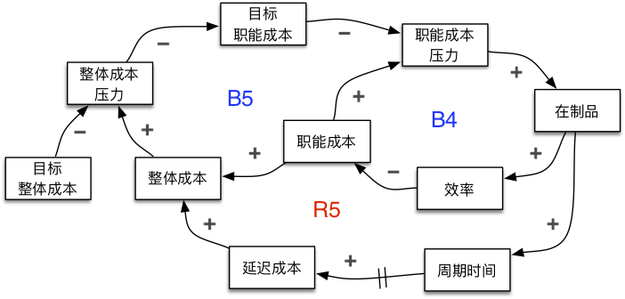
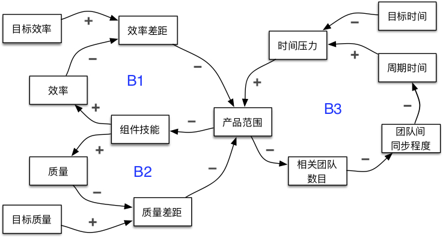
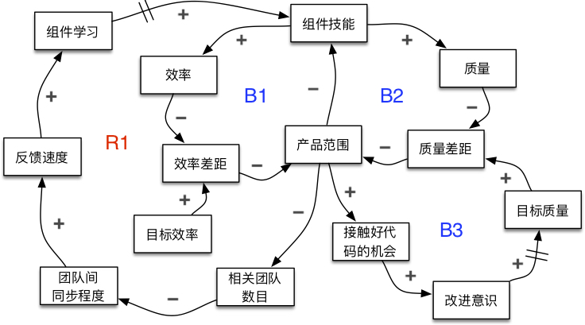
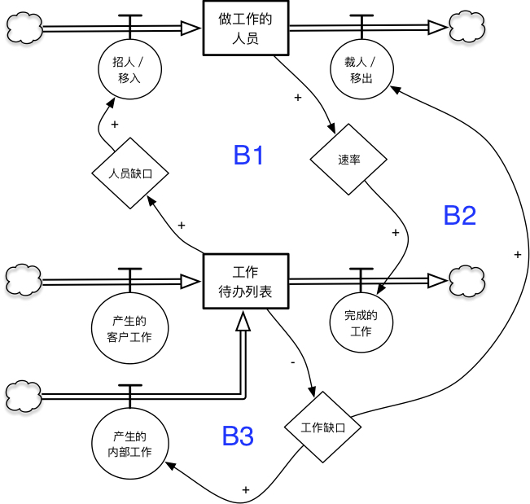
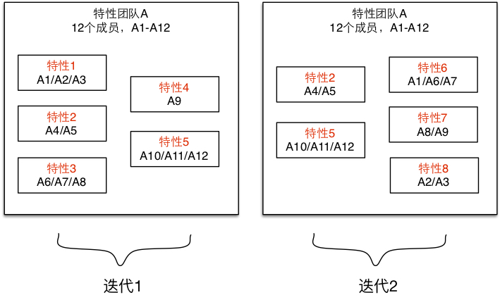
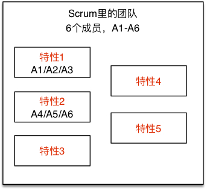
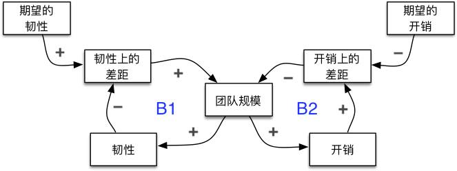
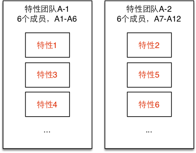

#第五章 人员设计选择

本章专注于人员相关的设计选择，主要以团队为基本组织单位，包含真正的团队和项目组“团队”。

##1. 特性组还是特性团队？

项目在团队方面就是特性组，特性组还是特性团队的选择我们已经在第三章第2节中阐述。

##2. 单一职能团队还是跨职能团队？

在敏捷开发中这听起来应该是个容易的选择，然而在很多组织里单一职能团队比如测试团队还是普遍存在。它的存在确实是有一些力量支持，通过理解这背后的因素和动态，我们会做更明智的选择。

###2.1 职能专业化

我们为什么要创建单一职能团队？答案经常与效率和质量相关，由B1和B2回路呈现。我们又为什么要创建跨职能团队？答案经常与周期时间相关，由B3回路呈现。周期时间又与速度和灵活性相关。

**回路B1**：职能专业化以提升效率

当意识到效率差距时，我们缩小团队的职能范围以发展更多专业技能，从而带来效率提升，效率差距得以减小。

**回路B2**：职能专业化以提升质量

当意识到质量差距时，我们缩小团队的职能范围以发展更多专业技能，从而带来质量提升，质量差距得以减小。

**回路B3**：跨职能以提升速度

当感受到时间压力时，我们扩大团队的职能范围以减少相关团队的数目，使得团队间等待变少，从而带来周期时间的缩短，时间压力得以减弱。

只看到这些的话，选择单一职能团队还是跨职能团队是在效率和质量与速度之间进行权衡。

###2.2 职能学习

我们如何提升某个职能的技能呢？传统的思路是通过专注于某个职能来学习。尽管有一定道理，这样的理解并不完整。职能技能的提升也取决于能否快速得到反馈，以及对其它相关职能的理解。

**R1/R2回路**：部门壁垒影响职能学习

当我们增强职能专业化以提升效率和质量（B1/B2回路）时，职能团队之间的壁垒变强，从而降低了对相关职能的理解，逐渐使得职能学习效果变差，反而对职能技能的提升起到了负面作用。这样一来，R1/R2回路与B1/B2回路一起形成了“饮鸩止渴”系统基模的动态。

**R3/R4回路**：反馈速度影响职能学习

当我们增强职能专业化以提升效率和质量（B1/B2回路）时，职能团队之间的等待也会变长，从而降低了反馈速度，逐渐使得职能学习效果变差，反而对职能技能的提升起到了负面作用。同样地，R3/R4回路与B1/B2回路一起也形成了“饮鸩止渴”系统基模的动态。

上述动态给跨职能团队又增加了一些优势，因为跨职能团队可以带来对相关职能的更好理解和更快的反馈速度，而这些都有利于职能学习。需要指出的是，跨职能团队得抛弃传统的瀑布开发实践，而采用敏捷开发实践，尤其是验收测试驱动开发，以真正带来跨职能的交叉学习和快速反馈。

###2.3 职能局部优化

职能团队专注在自己的范围内去优化，这经常导致局部优化 - 职能变好，整体却没变好甚至变差。

**B4/B5回路**：在职能范围内增加在制品以节省成本

为了应对层层分解下来的成本目标，职能团队在自己的范围内增加在制品。这让该职能团队更为高效，使其职能的成本降低，进而降低整体成本。一个常见的做法是测试团队会把很多需求聚集起来一起测试，因为从他们的角度来说这最能节省测试成本。

**R5回路**：在制品增加了延迟成本（Cost of Delay）

随着在制品数量变高，周期时间变长。这带来了延迟成本的增加，进而提高了整体成本。延迟成本既有对开发的（比如因为测试反馈延迟而带来返工成本的增加），也有对产品的（比如因为发布市场延迟而带来客户价值的降低）。B5回路和R5回路形成了“饮鸩止渴”系统基模的动态。

随着团队的职能范围变大，团队更有可能全局优化 - 整体变好。

---

短期来看，单一职能团队还是跨职能团队的选择是在效率和质量与速度之间的权衡。然而，职能学习也得益于反馈速度和对其它相关职能的理解，而这是跨职能团队的优势，因此长期来看跨职能团队反而有助于获取效率和质量。另外我们需要注意单一职能团队经常局部优化，而跨职能团队则更可能全局优化。

##3. 组件团队还是特性团队？

组件团队负责产品技术架构维度的组件或模块，通常它无法独立完成端到端的特性交付；而特性团队则负责端到端的特性交付，通常意味着跨组件。

###3.1 产品范围

分析这组选择时最困难的步骤是定义合适的变量以反映组件团队和特性团队的差异。在上一组选择里，单一职能团队和跨职能团队的差异很容易通过团队的“职能范围”变量来定义；而区分组件团队和特性团队的变量又是什么呢？我们试着从几个来源（Scrum、SAFe和LeSS）来寻找线索以弄清什么才是两者之间最本质的差异。

1、Scrum要求特性团队吗？

如果你去读Scrum指南，以下是（开发）团队的定义：
> “开发团队包含了各种专业人员，负责在每个Sprint结束时交付潜在可发布并且完成的产品增量。”
> 
> “开发团队是跨职能的，团队作为一个整体，拥有创建产品增量所需的全部技能。”

很显然该团队是跨职能的。然而，对它是组件团队还是特性团队并没有清晰的表述。这带来了很多关于跨职能团队是否隐含了特性团队和它们是否是一回事的困惑。

2、SAFe要求特性团队吗？

我的理解是SAFe并不要求特性团队，SAFe也建议特性团队，但这并不是它最本质的组成。一个社区里的朋友与我争论说SAFe也是要求特性团队的，他的理由是，因为SAFe在团队层面用Scrum，而Scrum是要求特性团队的，所以SAFe也就隐含着要求特性团队了。这个论据受限于同样的困惑 - Scrum要求特性团队吗？

如果你去读SAFe，以下是（敏捷）团队的定义：
> “敏捷团队由一小拨专职人员组成，他们合起来具备在短时间内定义（阐述和设计组件／特性）、构建（实现组件／特性）、测试（运行测试用例和验证组件／特性）价值增量所需要的技能。”

很显然该团队也是跨职能的。除此之外，组件团队和特性团队似乎都是可能的。

3、LeSS要求特性团队吗？

在LeSS中，以下规则清晰地表述了LeSS要求特性团队：
> “大多数团队是聚焦客户的特性团队。”

回到Scrum，它在定义团队时使用了“完成的产品增量”的说法。带来困惑的根源来自于对什么是产品并不清晰。在SAFe里，它使用了“价值增量”的说法，但这对解惑帮助并不大，因为什么是价值也并不清晰。

“什么是产品”这个问题听起来很简单却值得深入思考。LeSS中有说明，“当开始LeSS导入时，需要澄清的前几件事之一就是究竟什么是你的产品”。特性的定义是依赖于产品的定义的。产品的定义决定了特性的边界，因为特性在产品范围内是端到端的。

* 如果你把你的组件作为产品，对组件的需求就成了特性
* 如果你把你的平台作为产品，对平台的需求就成了特性
* 如果你把你的“产品”作为产品，对“产品”的需求就成了特性
* 如果你把你的解决方案作为产品，对解决方案的需求就成了特性

特性其实是连续体（多大范围的特性）！

组件团队和特性团队的差异可以最终归结为产品范围的差异，这样一来我们就可以引入“产品范围”这一变量来表示组件团队和特性团队。“产品范围”越大意味着越接近特性团队；“产品范围”越小意味着越接近组件团队。

###3.2 组件专业化

我们为什么要创建组件团队？答案经常与效率和质量相关，由B1回路和B2回路呈现。我们又为什么要创建特性团队？答案经常与周期时间相关，由B3回路呈现。这跟单一职能团队和跨职能团队的选择背后涉及的因素和动态非常类似，只是把“职能范围”换成了“产品范围”。

**B1回路**：组件专业化以提升效率

当意识到效率差距时，我们缩小团队的产品范围（也就是组件化）以发展更多组件相关的专业技能，从而带来效率提升，效率差距得以减小。

**B2回路**：组件专业化以提升质量

当意识到质量差距时，我们缩小团队的产品范围（也就是组件化）以发展更多组件相关的专业技能，从而带来质量提升，质量差距得以减小。

**B3回路**：特性化以提升速度

当感受到时间压力时，我们扩大团队的产品范围（也就是特性化）以减少与交付相关团队的数目，增加团队间同步程度，从而带来周期时间的缩短，时间压力得以减弱。

只看到这些的话，跟单一职能团队还是跨职能团队的那组选择一样，选择组件团队还是特性团队也是在效率和质量与速度之间进行权衡。

###3.3 组件学习

组件学习的相关动态与职能学习非常类似。传统的思路是通过专注于某个组件来学习（也就是组件专业化），但是组件学习的效果也取决于反馈，以及拓展工作到其它组件所带来的知识广度。

**R1回路**：反馈速度影响组件学习

当我们通过团队组件化以提升效率（B1回路）时，因为交付一个特性所涉及的组件团队变多，组件团队间的同步程度变低，使得反馈速度变慢。一个典型的情况就是因为某个组件工作还未完成，整个特性的测试就没法进行，这样一来已完成工作的组件团队也没法及时得到反馈，导致组件学习减少， 从而技能变弱，效率反而变低。这个R1回路与B1回路一起形成了“饮鸩止渴”系统基模的动态。

**B3回路**：对低质量习以为常

团队组件化是为了提升质量（B2回路），但是组件化使得团队长期工作于同一组件，由于接触的代码只是自己组件的，“烂代码看久了也会习惯”，没有机会接触更好的代码导致改进意识降低，从而逐渐降低质量目标。这个B3回路和B2回路形成了“目标侵蚀”系统基模的动态。

同样地，上述动态给特性团队又增加了一些优势，因为特性团队带来的组件间透明性和更快的反馈都促进了学习。

---

组件团队还是特性团队的这组选择背后涉及的因素和动态与之前的单一职能团队还是跨职能团队的选择非常类似。特性团队优化的首要系统目标是周期时间，同时如果能有效地利用它在支持学习上的优势，是可能做到兼顾效率和质量的。

##4. 专业特性团队还是全面特性团队？

特性团队是否需要专业化？比如一个特性团队只做机票相关的业务，另一个特性团队只做酒店相关的业务，它们在各自业务上专业化。另一个选择是不做这样的专业化，两个特性团队可以按需工作在机票和酒店业务上，我把它叫做全面特性团队。这组选择本质上就是第四章第3节“一份产品待办列表还是多份产品待办列表”的选择，优先级范围和团队技能是其中主要的考虑因素。

有一个与此相关的现象值得展开，很多产品开发组织都越变越大。

上图并非CLD（Causal Loop Diagram / 因果回路图），而是SFD（Stock & Flow Diagram / 存量流量图）。它是系统思考的另一个常用工具，使用它是因为对这个动态而言存量和流量的区分能让表述更清晰，从而更容易理解。

在CLD中，所有的都是变量。在SFD中，有三类不同的变量：存量在图中用矩形表示，流量在图中用椭圆形表示，辅助变量在图中用菱形表示。流量又进一步区分为流入量和流出量。流入量增加了存量，而流出量减少了存量。因此当你通过数链路数目以决定回路类型（增强还是平衡）时，你得把流入存量这段当作正向（+），而把流出存量这段当作负向（-）。

**B1回路**：招人解决人员缺口

越多的客户工作进来；越长的工作待办列表；越大的人员缺口；越多的招人或者移人进来；越多人做这块工作；越高的速率；越多的工作被完成；越短的工作待办列表。简而言之，B1回路呈现的是通过招人来应对增长的工作。

来自客户的工作量会波动。如果我们对产品整体排优先级，对某个业务领域而言，这种波动很自然会发生。当客户工作减少时（也就是产生了工作缺口）有两个解决方案，分别呈现为B2回路和B3回路。

**B2回路**：移人解决工作缺口

越少的客户工作进来；越短的工作待办列表；越大的工作缺口；越多的裁人或者移人出去；越少人做这块工作；越低的速率；越少的工作被完成；越长的工作待办列表。假设裁员不可取，B2回路呈现的是通过把一些人从产品的这个部分移走来应对工作缺口。然而，实际情况却是更多时候我们看到B3回路。

**B3回路**：创造内部工作解决工作缺口

越少的客户工作进来；越短的工作待办列表；越大的工作缺口；越多的内部工作被创造出来；越长的工作待办列表。当有人员缺口时，我们采用B1回路；当有工作缺口时，我们采用B3回路。奇妙的事情发生了，因为“做工作的人员”这个存量没有了流出量，它自然只会不断增长。

现实中是什么让B2回路很难发生？一旦把一个组固定在产品的某个部分，强调对那部分的职责推动了孤岛思维，形成了部门墙。最终使得维护这个组的需要被放在了实际工作情况之上。那么通过外包让B2回路发生呢？这确实是针对这个问题传统的应对方案。然而，外包带来的问题其实远比它解决的要更多。

专业特性团队就是把特性团队固定在专业领域。如果我们对整个产品排优先级，进入某个领域的工作势必会波动。当我们围绕可变工作固定了组，潜在的动态就决定了这个组会不断变大。因为制约全面特性团队的一个重要因素是团队技能，团队技能能够多大程度上扩展以适应动态的工作取决于上下文，但是将一个团队固定于某个领域显然降低了灵活性，同时也浪费了团队学习扩展的潜能。

同样的动态也发生在组件团队上，当我们对特性优先级排序时，需要各个组件改动的工作也是动态的，因此会导致组件团队陷入B1回路和B3回路的交替中，工作变多时招人，工作变少时创造内部工作来填补，组件团队也会越变越大。

---

“专业特性团队还是全面特性团队”的选择和“一份产品待办列表还是多份产品待办列表”的选择本质上是一个问题的不同视角。多个团队共享一份产品待办列表意味着这些团队是全面特性团队；而每个团队有各自的产品待办列表，也就是整个产品有多份产品待办列表，则意味着这些团队是专业特性团队。为了在整体产品层面有更高的价值和灵活性，我们需要更为全面的团队，全面的团队也能避免组织规模过大（当然变大组织也可能就是你的系统目标：），而这对团队技能则是个挑战。

##5. 重谈特性团队

在我的咨询工作中碰到这样一个组织。他们告诉我他们已经有了特性团队，“特性团队是作为直线组织单元稳定存在的，大约10-15人。”这样的团队规模有些不好的味道，于是我进一步了解，发现情况是这样的。

直线团队A是他们组织里其中一个特性团队，有12个成员，示意为A1-A12。迭代1时有5个特性在开发中，不同的成员在做不同的特性（特性1-5）。到了迭代2，特性1、3和4已经结束了，一些成员继续做之前的特性（特性2和5），而另一些成员则重新组合工作于新的特性（特性6、7和8）。

###5.1 共同责任和稳定

这里面真正的团队是直线团队A，还是各个特性x团队？

究竟什么定义了真正的团队？《团队智慧：创建高效能组织》书中对团队的定义包含了共同目标、共同责任和成员之间相互依赖。简而言之，团队成员协作实现共同目标并承担共同责任。

因为只有工作在特性x上的人对该特性的交付负责，而不是整个团队来负责，我会认为直线团队并不是真正的团队，它更象是个工作组；而真正协作的单元是那些特性x团队。因此这里是稳定的直线A工作组和动态的特性x团队。

参照第三章第2节“特性组还是特性团队“中比较两者不同的表格，我们发现该组织中的特性x团队和定义的特性团队主要差别在于是否稳定；而该组织中的直线A工作组和定义的特性团队主要差别则在于是否承担共同责任。

为什么稳定重要？主要的支持论据来自于《高效团队－领导团队走向成功的5大黄金法则》一书中提到团队绩效在团队成立后3-4年才达到顶峰。依据常识我们也能理解团队协作需要默契，而默契的建立需要时间和持续改进。又为什么共同责任重要？软件开发有内在的不确定性，因此团队不可避免会碰到超越他们计划的意外情况。是团队就意味着作为整体能够响应做出调整。

我们如何从现状演进为特性团队呢？一个方案是将直线A工作组变成真正的特性团队，它已经是稳定的组织，这里需要的改变是让整个组对所有特性承担共同责任。另一个方案是将特性x团队变成真正的特性团队，它已经承担共同责任，这里需要的改变是让它稳定下来。有趣的是，相比于通常建议的团队规模，第一个方案中的团队规模过大，而第二个方案中的团队规模又过小。

###5.2 韧性和开销

团队规模过大和过小各自的问题又是什么呢？Scrum指南中对此是这样解释的：

> “开发团队最佳规模是足够小以保持敏捷性，同时足够大可以在迭代内完成重要的工作。少于 3 个人的开发团队，成员之间没有足够的互动，因而生产力的增长不会很大。过小的团队在 Sprint 中可能会遭遇到技能上的约束，进而导致开发团队无法交付潜在可发布的产品增量。超过 9 人的团队则需要过多的协调沟通工作。对经验过程而言，大型开发团队会产生太多的复杂性而变得无用。”

我以为3个人的团队规模其实是太小了，即使他们已经能具备端到端的技能。我们先来理解一下团队承担共同责任在实践层面意味着什么。

试想一个Scrum团队在一个迭代内交付5个特性的情况。一个好的团队不会同时开发5个特性，但还是可能同时开发其中两个特性，如上图所示。那么A1/A2/A3和A4/A5/A6不也同样是在团队内的动态小组吗？是也不是。

如果考虑一起开发特性1的A1/A2/A3更紧密地协作并学习那个特性相关的细节，他们确实是个小组。在开发同一特性的那些天里，相比和其它成员他们之间有更强的连接。但是，团队承担共同责任意味着当工作于特性1的三个成员（A1/A2/A3）发现工作量远超预期或受困于难题，而特性1对于整个团队来说又是最高优先级时，他们会提出来和其他组员一起商量以决定如何适应。为了能够帮上忙，整个团队会在产品待办列表梳理和计划时学习所有的特性，并且在站会上每个成员都会检视进度，以使团队处于随时可以“蜂聚”完成某个特性的状态。从这个角度讲，他们又与之前团队内的动态小组不同。

一方面，我们想构建韧性，从而可以利用整个团队的技能和产能来交付高优先级的特性。另一方面，我们想保持合理的开销，因为每个团队成员都得花费精力学习了解团队所有的工作。

**回路B1**：扩大团队规模以增加韧性

团队规模越大，越多人可以蜂聚帮忙，作为一个团队就越有韧性。

**回路B2**：缩小团队规模以减少开销

团队规模越大，越多人需要投入准备以能帮上忙，越多的开销，直到我们不再能承受这些开销。

团队规模平衡了这两个因素。在我的经验里，合适的团队规模是5-7人。一个3人团队不能有充足的韧性，而一个10人团队则带来了太多开销。

###5.3 两个替代方案

针对最初的情况（一个大的特性团队，里面有一些动态小组各自做不同的特性），我们有什么替代方案呢？

1、把大的特性团队拆成两个小的特性团队，如下图所示。

每个团队都对一组特性承担共同责任，而且每个团队都长期稳定。这是一个很直接的方案。

2、保持一个大的特性团队，里面有一些动态小组各自做不同的特性组，如下图所示。

这个方案跟最初的情况不同在于动态小组是做一组特性，而非一个特性。这样能在韧性和开销之间取得更好的平衡。共同责任发生在中等规模的特性组里，而稳定性则保持在较大的特性团队。

这样做显然比第一个替代方案更为复杂，那么它带来什么好处吗？它避免了强行把相关的工作拆分到两个团队。让一个组承担所有相关的工作更能产生凝聚力。这本质上跟时间盒强行把相关的工作拆分到两个迭代是否好的争论是一回事。

##总结

在这一章中，我们探讨了下列几组围绕人员的设计选项：

* 特性组（项目组）还是特性团队？
* 单一职能团队还是跨职能团队？
* 组件团队还是特性团队？
* 专业特性团队还是全面特性团队？
* 团队的合适规模是多大？

产品开发组织的系统目标是快速交付有价值的产品，而选择全面的跨职能特性团队设计优化了该系统目标。效率和质量是采用单一职能团队、组件团队和专业团队的初衷。为了在采用全面的跨职能特性团队时能兼顾效率和质量，一方面需要利用团队的跨职能、跨组件、跨专业来提升协作和学习；另一方面可以建立职能、组件和专业的实践社区以形成有效互补。除了跨职能特性团队需要包含的技能会影响团队规模外，真正的团队通过承担共同责任形成韧性，为了能够承担共同责任又会产生开销，因此团队规模也是韧性和开销之间的权衡。