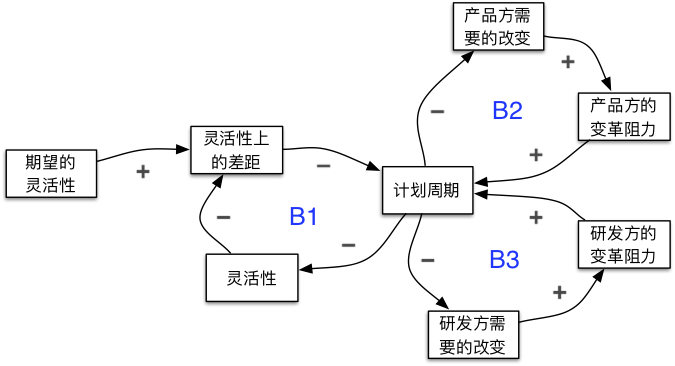
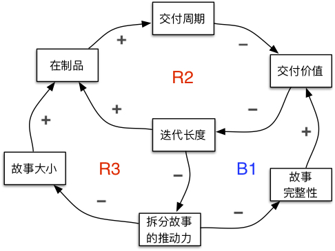
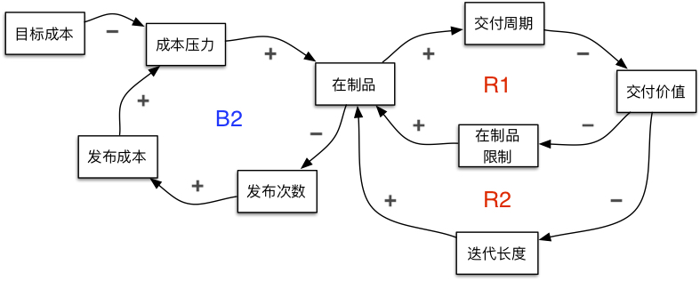
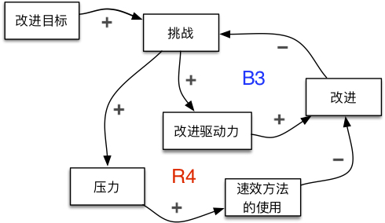

#第六章 时间设计选择

本章专注于时间相关的设计选择，产品开发中的时间周期可以根据它是否可变和长短不同分成以下选项。

| 周期时间 | 短 | | 长 |
| :---: | :--- | :---: | ---: |
| 固定 | 迭代 | 超级迭代 | 项目（固定时间发布） |
| 可变 | 流 | | 项目（固定范围发布） |

根据发布策略的不同，项目周期可以是固定长度或者可变长度。当采用固定时间的发布策略时，项目意味着固定的周期时间。当采用固定范围的发布策略时，项目意味着可变的周期时间。无论是固定时间还是固定范围（包含了批量需求），项目通常都意味着较长的周期时间。

迭代是个时间盒的概念，也就是固定时长，最常见的是两周的迭代周期。多数的敏捷产品开发都基于迭代。在大规模敏捷产品开发框架中，SAFe引入了超级迭代（PI: Program Increment）的概念，它由多个迭代组成，因此还是时间盒的概念；而LeSS则坚持迭代周期。无论迭代还是超级迭代，它们都是固定的周期时间。

作为敏捷产品开发的另一种方式，看板则是基于流。流是一个需求流经产品开发系统的时间周期，因此它意味着可变的周期时间。流和固定范围的项目其实都是根据工作来决定时间周期，它们的工作批量从小到大，它们的周期时间相应地从短到长。

我们接下来对这些选项组合进行分析。

##1. 项目还是迭代？

项目无论是固定时间还是固定范围，它的周期时间跟迭代相比都会更长。分析这组选择的关键变量是周期时间；它可以长可以短，长意味着项目，短意味着迭代。

事实上，这组选择的分析我们已经在第三章第3节中从计划周期和发布周期两个方面进行了阐述。

##2. 项目还是流？

当我们比较流和固定范围发布的项目时，两者之间的差异其实是需求批量的差异。分析这组选择的关键变量是需求批量；它可以大可以小，大意味着项目，小意味着流。看似是时间方面的选择其实本质上是工作方面的选择。

事实上，这组选择的分析我们也已经在第三章第1节中阐述。

##3. 迭代还是超级迭代？

SAFe里的超级迭代缺省由四个正常迭代加上一个叫IP（Innovation and Planning，创新和计划）的特殊迭代组成。在这一节中我们会探讨“迭代还是超级迭代”这组选择背后的系统动态。

为了能建立它们相关的系统动态模型，我们首先得理解它们之间的本质差别。

在Scrum中，计划周期和发布周期经常是跟迭代周期耦合的。事实上，这也区分了时间盒的方式和看板采用的流的方式。然而，即使在Scrum中，计划周期和发布周期也并不完全绑定。事实上，有些团队按迭代发布，有些团队发布得更频繁 - 甚至是持续发布，有些团队则发布得更稀少 - 几个迭代发布一次。

超级迭代还是一个时间盒，经常也是耦合了计划周期和发布周期。当然，SAFe中有“按节奏计划，按需要发布”的说法，这在本质上和Scrum的情况是一样的。有些团队按超级迭代发布，有些团队发布得更频繁，有些团队则发布得更稀少，比如某个超级迭代只是做了内部发布。

当系统建模时，我们把计划周期和发布周期作为两个变量。同时做以下假设：

* 采用超级迭代意味着比迭代更长的计划周期，但是短于传统的项目计划周期
* 采用超级迭代意味着比迭代更长的发布周期，但是短于传统的项目发布周期

这样一来我们可以用同一组变量来反映从迭代到超级迭代进而到项目周期的变化。本质上来说，“迭代还是超级迭代”这组选择和“迭代还是项目”这组选择并无不同。在这里我们只是把之前较为抽象的计划成本和发布成本做更为具体的阐述。

###3.1 计划周期

缩短计划周期背后的驱动力是灵活性，也就是响应变化的能力。我经常听人说他们并不需要更高的灵活性，因为他们的市场相对稳定，他们的客户也没有那么经常变化。这种说法有一定的道理，但是忽视了动态性。市场变化也反过来受我们响应变化的能力所影响。当我们的灵活性低时，我们就会试着控制变化而非拥抱变化，从而带给我们“变化不多”的感知。当行业中有一家公司开始增加灵活性后，市场和客户看到了更多可能性，然后其它公司也就不得不跟上了。

缩短计划周期面临的阻力来自产品和研发两方面。因为各自都需要改变才能适应更短的计划周期，各种变革阻力也就随之而来。

**B1回路**：缩短计划周期以提高灵活性

当市场需要更多灵活性时，我们缩短计划周期，以提高响应变化的灵活性，从而缓解市场压力。

**B2回路**：产品方对缩短周期的阻碍

计划周期越短，产品方需要做出的改变越多，由此带来更大的变革阻力，从而阻碍更短计划周期的实现。

就产品和研发之间工作方式的现状而言，很多组织里的产品方不会跟研发团队按迭代工作，而只是在发布计划时跟研发协商合同。超级迭代计划与传统的项目计划及合同游戏多少有些相似，因此更可能被产品方所接受。与基于迭代的协作相比，这当然不够好。但从另一方面来说，超级迭代作为计划周期与传统的项目计划周期相比已经缩短了，所以也是进了一步。

产品方需要打破合同游戏的传统方式。合同游戏就是在一个较长周期的开始阶段就确定范围、时间和成本，然后让研发无论如何都按计划交付。在周期开始时我们掌握的信息是最少的，具备的理解是最弱的；在有很大不确定性的产品开发上下文里，这时做出的决策通常不是优化的。产品方需要意识到这一点，不迷信预测性，而是愿意通过持续的检查适应来优化最后交付的产品。

**B3回路**：研发方对缩短周期的阻碍

计划周期越短，研发方需要做出的改变越多，由此带来更大的变革阻力，从而阻碍更短计划周期的实现。

就团队结构和协调机制的现状而言，很多组织里的研发方是采用组件团队结构并由项目经理或类似角色来协调以交付特性。迭代让该现状难以继续，而超级迭代留有更多空间来包容现状。但从另一方面来说，超级迭代提供了诸如大房间计划这样的方式来增加自组织协调能力，以使在每个超级迭代周期里可以做到同步交付特性，相对于传统项目计划来说也是进了一步。

研发方的团队结构很可能会需要重新设计。传统的研发团队结构通常基于组件，而交付产品特性需要多个组件团队协同。在有大量需求的情况下，多个组件团队之间的同步变得困难。为了提高同步程度，特性团队是系统性的解决方案。当采用特性团队后，需要协调的人员都属于同一个团队，共享目标并共担职责，这使得计划协调的成本大为降低。

###3.2 发布周期

缩短发布周期背后的驱动力也是灵活性，而成本考虑对其是一个重要阻力。

**B4回路**：缩短发布周期以提升灵活性

当面临市场变化带来的压力时，我们缩短发布周期，以提高响应变化的灵活性，从而缓解市场压力。

**B5回路**：延长发布周期以降低成本

发布周期越短，发布频率越高，相应的发布成本也会越大。当成本大到一定程度后，成本考虑就成了制约更短发布周期的阻力。

就发布的现状而言，很多组织还是在发布前需要有一个“坚固”阶段。所谓的“坚固”就是在发布前补上未在完成定义之内的工作。每个超级迭代里的特殊迭代（SAFe以前把它称作HIP，其中的H就是Hardening“坚固”的首字母）包容了这样的做法，其实和传统瀑布项目的最后测试并修改缺陷的阶段并无本质不同。但从另一方面来说，按超级迭代发布比传统项目发布已经更频繁了，所以也是进了一步。

同样地，我们也需要打破发布的现状才能增加发布频率，从而进一步缩短发布周期。这里在发布上需要做出的改变有技术层面的，比如通过自动化测试以使每次发布回归测试所需的成本得到控制； 也有流程层面的，比如简化部署中的审核流程。

---

总结来说，相比迭代，超级迭代与传统项目的计划和发布周期更为接近。一方面，这减少了变革阻力，从而有利于推动向前；另一方面，这对现状的挑战不够大，从而有可能在导入后就停止了进一步的变革。

##4. 迭代还是流？

无论迭代还是流，其周期时间都较短。这组选择经常跟实施Scrum（迭代）还是看板（流）交织在一起，但我并不想去比较Scrum和看板，而只是关注迭代和流的不同思路。我们来认识它们在影响价值交付和持续改进方面的系统动态。

###4.1 价值交付

迭代和流都致力于最大化价值交付，并且都是通过减少在制品，只是用以减少在制品的方式不同。

**R1回路**：直接限制在制品（流）

这是看板的方式。在制品限制是指设置的最大允许在制品数量。在制品限制越低，在制品越少，从而交付周期越短，交付价值越多。

**R2回路**：间接限制在制品（迭代）

这是Scrum的方式。迭代限制了时间，迭代长度越短，在制品越少，从而交付周期越短，交付价值越多。

继续来看一下Scrum通过采用迭代限制时间来间接限制在制品做法的利弊。

交付的任何故事都需要落入一个迭代，也就是说，当计划迭代时，如果发现最后一个故事不能放进当前迭代，我们或者挑选另一个更小的故事，或者把这个故事拆分从而使更小的故事能够放进这个迭代。这是一把双刃剑，一方面它推动了故事拆分；另一方面也可能导致过度拆分后故事的完整性受到损害。

**R3回路**：迭代促进故事拆分

迭代长度越短，对拆分故事的推动力越大，故事越小，在制品越少。这其实就是在迭代本身间接限制在制品的基础上做了进一步增强，因为在制品受故事个数和故事大小两个因素的影响。

**B1回路**：过度拆分影响价值

迭代长度越短，对拆分故事的推动力越大，存在为了拆分而拆分的情况，使得故事的完整性变差，交付价值反而变小。故事不能被无限地拆分，一个故事在有价值的前提下能拆多小通常存在自然的限制。采用迭代会人为地破环故事的自然大小和完整性是一个最常提及的对迭代方式的争议点。

最大化价值交付的增强回路（R1和R2）能否一直持续？有一个限制因素必须提及：发布成本。

**B2回路**：发布成本的限制

在制品越少，发布次数越多，发布成本越高，导致成本压力变大，从而限制了减少在制品的努力。

这个限制其实就是第三章第1节中分析的需求批量背后的因素。当周期时间是首要关注时，我们减少需求批量，但是这会导致成本增加。成本作为次要关注，我们可以通过改进活动以降低发布成本对其尽量满足。

###4.2 持续改进

迭代和流都致力于持续改进，并且都通过创造合适的挑战来驱动改进，只是采用的具体方式不同。理解挑战和改进之间的关系对形成持续改进至关重要。我们首先来看为什么挑战必须适度。

**B3回路**：挑战驱动改进

挑战越大，改进的驱动力越强，改进越大，挑战得以满足。

**R4回路**：挑战过大导致权宜应急

挑战过大却将动力变成了压力，过大的压力促使更多速效方法的使用，反而减弱了实质的改进。B3回路和R4回路一起形成了“饮鸩止渴”系统基模的动态，这解释了过度挑战会带来的意外后果。

在达成了改进目标后，挑战就会消失，改进也相应趋于停滞。这是平衡回路的特征，而要让改进持续则需要形成增强回路，Scrum和看板都试图通过提高改进目标来形成持续改进。

**R5回路**：缩短迭代长度以提升挑战

这是Scrum的方式，缩短迭代长度有利于最大化价值交付，这里则显示了它对持续改进的作用。迭代长度越短，挑战越大，由此产生持续改进的驱动力。

**R6回路**：降低在制品限制以提升挑战

这是看板的方式，降低在制品限制有利于最大化价值交付，这里则显示了它对持续改进的作用。在制品限制越低，挑战越大，由此产生持续改进的驱动力。

**R7回路**：扩展系统范围以提升挑战

在Scrum中，这意味着扩展完成的定义；在LeSS中，这意味着扩展完成的定义、或者扩展产品的定义，或者两者兼而有之；在看板中，这意味着扩展看板系统的范围。系统范围越大，挑战越大，由此产生持续改进的驱动力。

**R8回路**：提高改进目标以提升挑战

R5-7回路本质上都是提高改进目标的不同方式。除此之外，让流顺畅和缩短周期时间是看板方法的重要目标；团队还可以通过展望下一阶段来定义自己的改进愿景。改进目标越高，挑战越大，由此产生持续改进的驱动力。

---

关于选择迭代还是流，我们应该认识到它们本质上是用不同的方式来减少在制品，而在制品的减少对价值交付和持续改进两方面都起着关键作用。

##总结

在这一章中，我们探讨了下列几组围绕时间的设计选项：

* 项目周期还是迭代周期？
* 项目（批量需求）还是流（个体需求）？(其实这是一组关于工作的设计选项）
* 迭代还是超级迭代？
* 迭代还是流？

从传统项目到超级迭代再到迭代，计划和发布周期逐步变短，从而提高了灵活性；但这一变革不可避免会受到来自各种现状的阻力。迭代和流主要的差别在于采用固定还是可变的时间周期，它们各有理由。但是事实上，它们共享最重要的两个目标：最大化价值交付和驱动持续改进，只是采用的方式不同而已。