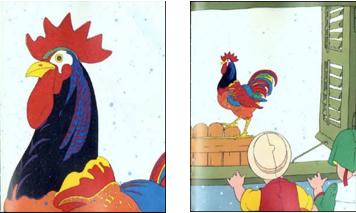
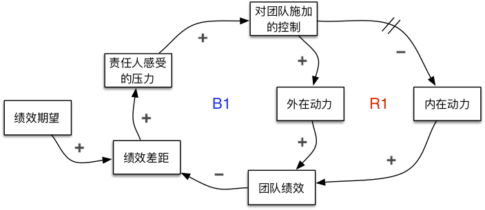
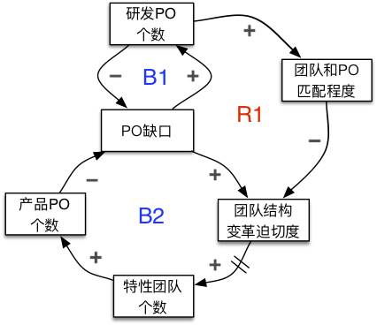
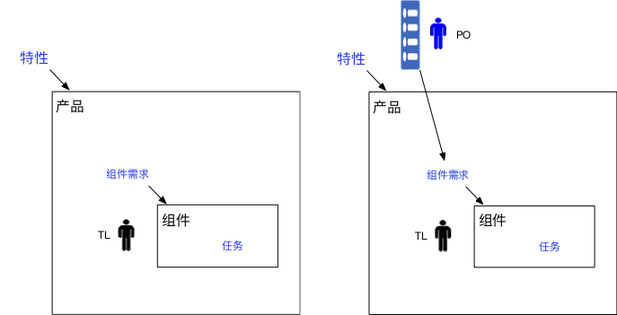
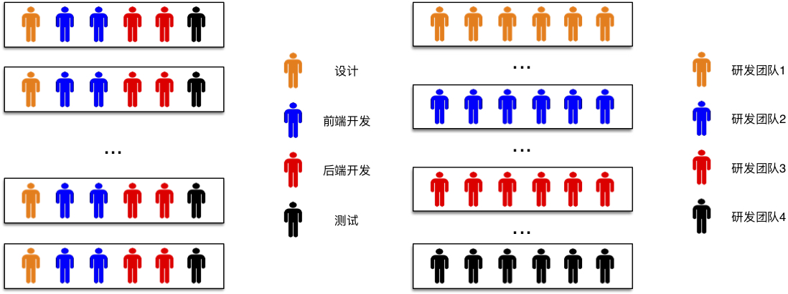
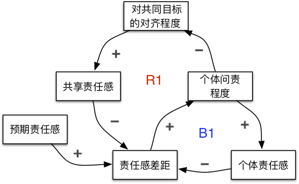
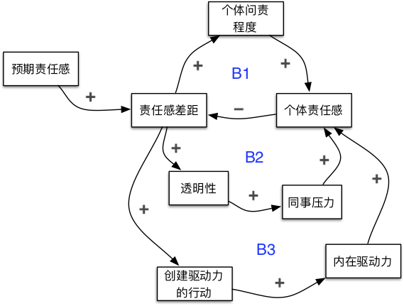
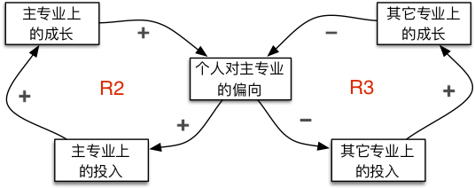
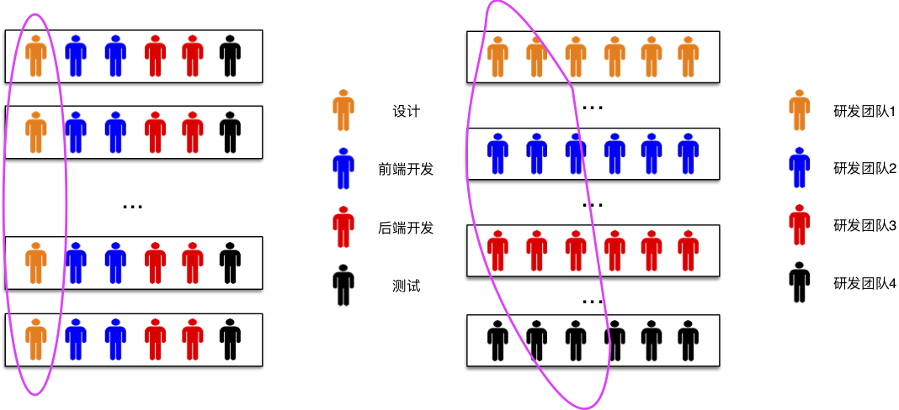
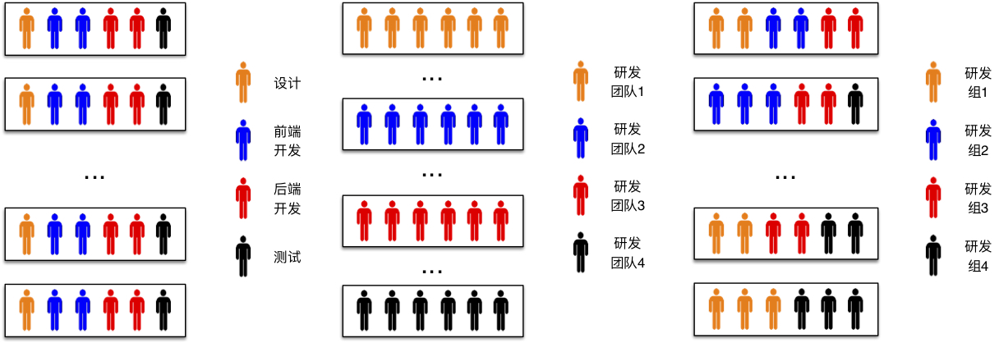

#第七章 管理设计选择

本章专注于管理相关的设计选择，而管理设计与人员设计紧密相关。传统产品开发组织里通常采用职能和组件团队结构，因此产品需求的交付需要协调多个团队来完成，而这就成了项目经理的工作。敏捷产品开发组织里则通常采用跨职能特性（也就是跨组件）团队，因此产品需求的交付可以由自组织团队独立完成。这带来了管理设计上最重要的选择 - 项目经理还是自组织团队？敏捷组织里的管理角色受到具体敏捷方法的影响，考虑到Scrum的广泛使用，我们会着重分析Scrum的角色和传统角色之间的差异，以帮助结合自己的组织上下文做出合理的选择。

##1. 项目经理还是自组织团队？

在第一章中，我们对比了矩阵型组织（一种传统产品开发组织）和基于LeSS的组织（一种敏捷产品开发组织），发现两者在项目管理上采用了非常不同的做法。在矩阵型组织里，项目管理由项目经理承担；而在基于LeSS的组织里，项目管理由PO和团队主要分担。

“分布式项目管理”是一个理解Scrum角色如何分工来管理项目的有效练习。因为LeSS还是Scrum，所以从中得出的结论同样也适用于LeSS。我们先把所有项目管理的任务写在报事贴上，然后把它们跟据在Scrum中由哪个角色承担来分类。下图是个典型的结果。

它显示出项目管理的工作是由Scrum角色分担了，并不需要项目经理的角色。每个Scrum角色与项目管理相关部分的重点如下：

* PO：管理版本，以需求条目、迭代和团队为管理单位
* 团队：管理迭代，以需求条目/任务、天和成员为管理单位
* SM：建设团队以使成员们能一起工作来交付产品
* 其它（未在Scrum中定义）：组建项目团队，这项任务在从项目模式到产品模式的转化中变得非常不同 - 临时动态的项目团队由长期稳定的产品团队所代替

经常有人会由此得出另外两个结论：

1. SM没有太多的工作要做
1. PO就是项目经理

这是快思考的通常表现。在这个练习中我们是从项目管理任务出发的。如果你应用慢思考稍加推理，就应该能注意到这里只是涉及了项目管理的工作。

更为可靠的结论相应地会是：

1. SM没有承担太多的项目管理工作
1. PO承担了一些项目管理工作

然后我们来看在项目管理工作之外的全局。系统思考一个重要的方面是看到全局。[《变焦》](https://www.amazon.cn/dp/B005TZQC3K/)是一本很棒的儿童书，它展示了通过拉远视线来逐步看到全局的过程。下图是其中一个片段。

类似地，我们可以拉远视线来看到Scrum角色的全局。

现在我们不仅只看到项目管理工作，拉远视线后的全局帮我们看到如下：

* PO：PO的主要工作是产品探索，也就是找到有价值的工作，参考[“80%的产品探索和20%的项目管理”](https://yihuode.io/articles/309)
* 团队：团队的主要工作是产品交付，通过自管理的方式，也就是能够管理自己的进度和流程
* SM：聚焦于对自组织和持续改进的辅导，而非短期交付

1、为什么PO？

为什么让PO在版本层面承担项目管理的工作，而非由专职项目经理来做？传统产品开发组织的核心是项目，在产品和研发之间有一个合同协商的阶段，当达成约定（常被叫做研发的承诺）后，交付的责任就被转移到研发，由项目经理来负责交付。敏捷产品开发组织的核心是产品，产品开发需要不断地检验适应以最大化交付产品的价值。这就意味着项目管理的对象其实持续在发生变化，并相互影响，由PO直接按迭代的节奏做出调整无疑是更为灵活的方式。

2、为什么自组织团队？

为什么让团队在迭代层面承担项目管理的工作，而非由专职项目经理来做？自组织团队管理自己的进度和过程对于产品开发这样的复杂性知识工作更为有效。设置专职项目经理来协调工作反而抑制了团队自组织的形成，这个动态我们已经在第三章第4节中进行了阐述。

在产品开发组织中，灵活性和复杂度是重要的特征。由PO和自组织团队在两个层面 - 版本和迭代 - 来分别承担项目管理的工作会更为合适。

##2. TL（Team Leader）还是SM（ScrumMaster）？

团队是有TL还是有SM？如果实施Scrum，答案就很简单，因为Scrum中是没有TL这一角色的。然而传统的团队通常是有TL的角色，这两者之间最根本的差别是什么呢？

很多人觉得两者有很大的差异，因为SM意味着引导教练，而TL则是指挥控制。这并不客观反映TL的定义，指挥控制更像是某些TL的领导方式。当然这里的“某些”在很多组织里确实也是大多数。SM是TL吗？有一个说法，一个运作良好的团队是SM的“产品”。从这个角度看，SM也是TL。

那么一个采用引导教练方式的TL就是SM吗？也不是，它们之间还有一个非常根本的区别。SM并不对交付负责，是团队自己对交付负责；而TL则通常是要对交付负责的。

心理学家Edward L. Deci写的一本叫[《Why we do what we do: understanding self-motivation》](https://www.amazon.com/Why-We-What-Understanding-Self-Motivation/dp/0140255265)书中描述了一个实验。在这个实验中，实验主体是老师。他们来实验室教学生如何解决问题。他们被随机分到两个组，两者唯一的不同是研究人员对其中一个组做了一个额外声明，“记得，作为老师你们有责任确保学生表现出高水准”。研究人员然后录下了教学过程并做了分析，结果令人吃惊。那些研究人员作了额外声明的老师在教学过程中所说的是另一组老师的2倍。他们还给出了多3倍的指令，以及多3倍的诸如“应该”或者“必须”这样的控制语句。

为了取得更好的教学结果，现实生活中很多人会向老师施压，比如学校或者家长。然而他们给老师的压力越大，老师会变得越加控制，从而削弱学生的内在动力和表现。这是个悖论，你越是施压老师产出结果，重要的结果越发难以出现。我们来看这个辅导的悖论对TL还是SM这一选择的影响。

**B1回路**：施加控制以增强外在动力

当意识到绩效差距时，负责团队绩效的责任人会感受到更多压力，转变为对团队更多的控制，以增强外在动力，从而提高团队绩效。

**R1回路**：控制减弱内在动力

控制带来了副作用，长期而言内在动力减弱了，团队绩效反而变差，导致绩效差距变大，产生更多压力。这是个恶性循环。

B1回路和R1回路形成了“饮鸩止渴”系统基模的动态。把SM的角色定义为纯粹的教练而不对交付负责是摆脱该动态的一个杠杆点。

Michael James在2013年上海Scrum Gathering上做的主题演讲“Human Beings and Scrum”中说到，“Scrum定义了专职角色来创建学习和创新团队，而没有赋予它冲突的职责。Scrum是唯一这样做的方法”。正是因为交付压力往往促使责任人做出一些对团队自主产生负面影响的行为，所以对交付负责被认为是一项冲突的职责。我自己在诺基亚作为研发领域经理的经历也能确认这一点。尽管我对自组织和自主深信不疑，当面临巨大的产品交付压力时，我还是无意识地（只是在反思时才意识到）变得更加控制。相反，当SM不用对交付直接负责时，她更关注团队是否变得更自主，并聚焦于使团队具备更多内在动力，最终带来团队绩效的提升。

然而对交付负责是TL角色定义的一部分，因此他不得不更多借助自己的修炼，以保持合适的心态。这种心态其实与父母的心态类似。父母在帮助孩子形成真我上扮演重要的角色。他们或支持自我或施加控制；相应地，孩子的内在动力或被培育或被损害。父母面临同样的悖论。当他们感受到要做一个“好”父母的压力时，他们变得控制，反而损害了孩子的内在动力，最终导致孩子没能形成真我。对于父母来说是没有“管理层”对他们施压的，那么他们的压力又从何而来呢？他们显然会受到社会的影响，比如周围的家长、学校的老师等等。要改变社会环境很难，就象你很难去改变管理层对TL的期望。无论作为父母还是作为TL，我们都需要学习如何在那样的环境下保持自主。

##3. TL（Team Leader）还是PO（产品负责人）？

传统的产品开发组织规模超过一个团队时，通常会以组件拆分团队，并对组件团队设置TL的角色。Scrum用于产品开发非常流行，以致于很多公司都会尝试。最直接的做法就是在现有的团队结构下引入Scrum角色，也就是为组件团队设置PO和SM的角色。

PO角色的存在是为了打破产品和研发之间的合同游戏，增强双方之间的协作，所以合适的PO应该来自产品方。但是在组件团队的情况下，团队PO则通常来自于研发。以下系统动态阐述了背后的原因。

**B1回路**：从研发内部找PO

导入Scrum带来了PO缺口。对组件团队来说，速效方案就是从研发内部找PO来管理该组件所有工作的优先级。

**B2回路**：组建特性团队并从产品方找PO

真正的PO是管理产品特性的优先级。当导入Scrum时，发现产品PO没法跟现有的组件团队直接对接，这增加了改变团队结构的迫切性，由此逐渐产生更多特性团队，进而能够从产品方找到更多真正的PO。

**R1回路**：研发PO造就Scrum形式主义

不幸的是，研发PO的存在提高了PO与组件团队的匹配程度，这降低了改变组件团队结构的迫切度，使得在组件团队结构下做形式化的Scrum成为常态。回路B1、B2和R1形成了“舍本逐末”系统基模的动态。

下图从左到右其实就是B1回路的做法，也就是为组件团队从研发内部找一个PO。因为之前只有一个TL角色，而Scrum里有PO和SM两个角色，两种常见的安排分别是：

1. TL做团队PO，这其实是一个假PO，因为他明显不对最大化产品价值负责；找另一个人做SM
1. TL做SM；找另一个人做团队PO

无论哪种安排，问责通常还是在TL上。

Scrum角色到位后，团队PO会为组件创建并非真正意义上的产品待办列表，但它确实是组件团队所有工作的唯一来源；而SM辅导团队自组织完成组件工作。

这些是好的进展。然而，却还是缺失了真正的Scrum背后最重要的一点，也就是通过检查产品增量，而非组件工作，来作出适应以使产品价值最大化。因此，我们仍然只是做了Scrum的形式。

下图从左到右则是另一个选择，保留TL但转变这个角色：1）针对组件做假的Scrum；2）转移焦点到产品和特性；3）推动组织重新设计。

让我来展开：

1. 针对组件做假的Scrum
 * 整合所有的组件工作并进行优先级排序（也就是假PO做的事）
 * 辅导团队自组织交付组件（也就是SM做的事）
1. 转移焦点到产品和特性
 * 连接组件工作和产品特性
 * 连接组件团队和真正的PO
 * 辅导团队和其它组件团队一起自组织交付特性
 * 辅导真正的PO对产品进行检查并适应
1. 推动组织重新设计
 * 传播通过组织重新设计形成特性团队的知识和经验
 * 促进交叉学习和技术卓越以为未来的变革做准备

这样的做法更好地遵循了Scrum背后的核心想法，尽管没有引入Scrum角色而是保留了传统的TL角色，却更接近Scrum的实质。

只有组织重新设计形成了特性团队后，团队才会直接跟真正的PO工作，并承担端到端交付特性的职责。这也就是B2回路的做法。最终TL的管理职责会弱化，逐步演变成一个不直接对交付负责的教练角色（SM）。到那时才是真正的Scrum。

---

在组件团队的结构下，与其引入研发PO来做形式上的Scrum，不如保留TL在实质上连接组件工作和产品特性，连接组件团队和真正的PO，并寻找合适机会推动组织重新设计以形成特性团队。

##4. 职能/组件经理还是研发经理？

当我们采用了跨职能特性团队结构时，这组选择其实就变成了一个团队的成员是否汇报给同一经理。如果采用职能或组件经理，那么跨职能特性团队成员就得汇报给多个经理（如下面左图所示）；而如果采用研发经理，那么整个跨职能特性团队就可以汇报给同一经理（如下面右图所示）。图中的框代表了跨职能特性团队，而颜色则代表了汇报线。

###4.1 个体责任和共享责任

采用职能/组件经理意味着经理对下属团队成员的工作有更深入的理解，比如测试经理对团队里测试人员的工作有更好的把握，从而使得问责更为容易。采用研发经理意味着经理不太可能对所有成员的专业（职能或者组件）都有深入理解，从而担心无法有效问责。我们先来分析这个方面。

**B1回路**：通过问责以提升责任感

当意识到责任感缺失时，通过增加对个体的问责程度，个体责任感得到提升。采用职能/组件经理能让这个回路有效工作起来。

**R1回路**：个体问责减弱共享责任

个体问责程度提升后，团队成员对共同目标的对齐程度变低，从而减弱共享责任感。这体现为对工作交叉部分互相推诿，不愿意承担责任，由此进一步加强个体问责。回路B1和R1形成了“饮鸩止渴”系统基模的动态。

为了打破加强个体问责的恶性循环（R1回路），我们需要寻找B1回路的替代方案。

**B2回路**：通过同事压力以提升责任感

当意识到责任感缺失时，我们增加各自工作的透明性，以形成同事压力，从而提升个体责任感。

**B3回路**：通过驱动力以提升责任感

当意识到责任感缺失时，我们采取更多行动以创建驱动力。自主、专精和目的是Dan Pink的[《驱动力》](https://www.amazon.cn/dp/B07D5159V5)一书中提到的三个产生内在驱动力的核心要素，我们可以相应地采取行动以增加自主性、提升技能的机会和所做工作的目的。由此增强个体的内在驱动力，进而提升个体责任感。

###4.2 职能/组件的能力提升

跨职能特性团队成员的能力提升对团队是否具备充足的灵活性至关重要。团队要交付的需求主要是基于客户价值考虑，因此它不会完美地匹配成员现有的技能。传统项目管理的思路是从职能/组件团队里根据工作动态分配资源来解决这一问题，这也导致了常有成员只是部分时间在某个项目组工作；而跨职能特性团队的思路则是通过团队成员的交叉学习，以提升在各职能/组件上具备的能力。这里的目标倒不是每个成员都成为全栈工程师。大家都是全栈工程师确实能带来最大的灵活性，但这是一个充分不必要条件。必要条件是团队成员能够扩展学习，以成为多面专家。下面我们就来分析汇报线对此可能产生的影响。

首先，我们来看团队成员的角度。对某个团队成员来说，我们把他所在汇报线的专业（职能或者组件）称为主专业，除此之外的则称为其它专业。

**R2回路**：主专业投入越多，主专业成长越多

属于某个专业的汇报线让团队成员偏向于该专业，从而在该专业上投入更多，获得更多的成长，这又加强了对该专业的偏向。

**R3回路**：其它专业成长越少，其它专业投入越少

团队成员偏向于自己所属汇报线的专业意味着他对其它专业的投入降低，成长减少，这又进一步减弱对其它专业的偏向。

这是个自我增强的动态，对形成多面专家不利。为了推动扩展学习，有以下常见措施：

* 所有的团队成员都是产品开发者（包容所有的职能/组件），而非基于职能/组件的开发者（比如开发/测试、前端/后端工程师）
* 制定个人能力提升计划，兼顾深入某个专业和扩展到其它专业。这需要在团队层面对齐，以形成合力使团队的能力具备全面性和灵活性。

通过以上措施，我们试图摆脱汇报线的影响，让成员在不同专业上的投入更为合理，从而产生更多多面专家。这些措施影响的不仅是学习投入，还有分工策略；而消除汇报线的暗示能让团队成员更为自由地扩展自己的第二第三专业。当团队成员具备多种技能时，仍然按职能/组件来组织汇报线实际上也很难操作。

其次，我们来看职能/组件经理的角度。对某个职能/组件经理来说，跨职能特性团队中的成员有向他汇报的下属，也有向其他经理汇报的非下属。

**R4回路**：辅导下属越多，下属成长越多

经理偏向于自己汇报线的成员，对他们的辅导更多，他们由此获得更多的成长，这又加强了经理对他们的偏向。

**R5回路**：非下属成长越少，辅导非下属越少

经理偏向于自己汇报线的成员意味着他对其他成员的辅导减少，从而其他成员获得更少的成长，这又进一步减弱经理对他们的偏向。

这同样是个自我增强的动态，对形成多面专家不利。除了之前提到的统称产品开发者和个人能力提升计划，我们需要设法消除经理在辅导投入上的偏向。如果采用职能/组件经理，这意味着需要将辅导开放给所有团队成员，而非只是属于自己汇报线的成员。这并不自然。如果采用研发经理呢？需要指出的是这并不意味着研发经理都会具备所有职能/组件的专业技能，更可能的是他们具备不同专业背景，比如某个研发经理之前在测试专业上积累了很多的知识和经验。这时由他们在自己熟悉的专业对所有团队成员（至少是那些在某个阶段会工作于这个专业或者把这个专业作为扩展方向的成员）进行辅导。在跨职能特性团队结构下，这样的辅导将是跨团队的。

上面左图是采用职能/专业经理的做法，每个跨职能特性团队的成员汇报给多个不同的经理。图中纵向圈出的是一个基于职能/组件的汇报线，它是静态的。

上面右图是采用研发经理的做法，每个跨职能特性团队的成员汇报给一个研发经理。图中纵向圈出的是一个基于职能/组件的社区，它是动态的。这给研发经理带来一些挑战，因为他汇报线的团队是横向的研发团队，而在专业上辅导的人员却来自不同的研发团队，比如通过基于职能/组件的社区。虽然在传统组织结构里经理只是辅导属于自己汇报线的成员，这种交叉会让他们有所不适，但它也提供了研发经理之间紧密合作的机会。

无论是从团队成员的角度还是从职能/组件经理的角度，都呈现了“强者愈强”系统基模的动态。过度专业化很可能是个自我实现的能力陷阱。

---

跨职能特性团队优化的系统目标是灵活性，而团队共享责任和扩展学习是实现该系统目标的两个重要方面。采用研发经理而非职能/组件经理更能促进共享责任和扩展学习，因此是与系统目标更一致的选择。

##5. 管理团队还是管理组？

当经理们在一起组成一个管理团队时，其实多数并不是真正意义上的团队，而只是一个管理组。两者之间最大的差别在于是否他们拥有共同目标并共享责任。当每个经理只是负责自己的部分，而只有这个管理组的领导对整体负责时，他们对共同目标的承诺只是停留在口头。

我们来看跨职能特性团队汇报给研发经理的情况。研发经理负责1）自己的汇报线团队，通常是多个团队；2）职能/组件的技能提升，会涉及到多个汇报线。按传统观念来说，这种汇报线之间的交错是希望避免的，但对形成管理团队这反而是个契机。

甚至有组织在这个基础上再进一步。通常来说，同一团队的成员汇报给多个经理对形成团队共同目标是不利的，这也是让跨职能特性团队汇报给同一研发经理的重要原因。但是考虑到团队的工作输入并非来自研发经理，而是PO或者产品经理，打乱汇报线对此并没有直接影响，同时却有可能推动研发经理对整体目标承担共享责任。

在该组织里，同一团队成员汇报给不同的研发经理，注意并不是不同的职能/组件经理。团队成员随机地汇报给不同的研发经理，因此研发经理汇报线里的成员会来自不同职能/组件，还会来自不同团队。这样的设置初听起来让人觉得奇怪，但其实他们试图以此来创建真正的管理团队！当任何一个团队都不只是汇报给单个研发经理，就能避免单个研发经理只关注自己的团队，从而促进多个研发经理一起协作以确保所有团队的成功。在这样的设置下，任何研发经理间的不对齐都会成为团队有效工作的严重障碍。这对研发经理是个挑战，但对形成真正的管理团队这一目标来说则是个机会。

这也让我回想起在诺基亚时候的一段经历。我当时的部门里有100多人，4个研发经理加上我形成了部门的管理团队。我们作出刻意的努力去创建一个真正的管理团队，我们尝试了：

* 经理给不是直接汇报给自己的团队担任SM，参见["经理作为ScrumMaster"](https://www.odd-e.com/material/2011/agile2011/Manager%20as%20SM%20in%20Agile%202011.pdf)的文章。
* 在部门层面创造研发经理间的协作机会，尤其在移除组织障碍、持续改进和实践社区这些方面。
* 不再把部门目标进一步分解到下一级的研发组并由特定研发经理负责，而是保持在部门层面。
* 不再由我给每个经理绩效反馈，而是举行管理团队的对话，每个经理都公开地给予和接受反馈。

打乱汇报线是另一个有意思的试验！创建真正的管理团队（而非管理组）挺难，却值得去追求。

上图呈现了从同一团队汇报给不同职能/组件经理，到同一团队汇报给同一研发经理，再到同一团队汇报给不同研发经理。我们需要深入理解背后的考虑才能基于自己的上下文做出明智的选择。

##总结

在这一章中，我们探讨了下列几组围绕管理的设计选项：

* 项目经理还是自组织团队？
* TL（Team Leader）还是SM（ScrumMaster）？
* TL（Team Leader）还是PO（产品负责人）？
* 职能/组件经理还是研发经理？
* 管理团队还是管理组？

在第五章“人员设计选择”中，我们已经分析了在以快速交付有价值的产品为系统优化目标时，采用跨职能特性团队更为有利。在此前提下我们来看管理设计选择，由PO/产品经理和团队在版本和迭代两个层面管理项目，而非由专职项目经理，是更为有效的选择。相应地，团队整体汇报给同一研发经理也更为自然，尽管打乱汇报线以创建真正管理团队的实验值得鼓励。另外，我们需要谨慎对待盲目引入敏捷角色以替代传统TL角色的做法。事实上，为组件团队引入PO带来更多形式主义；而特性团队的SM和TL的本质区别也相对细微。
