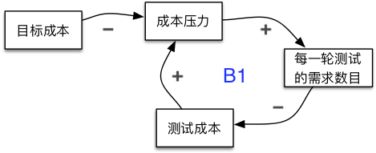
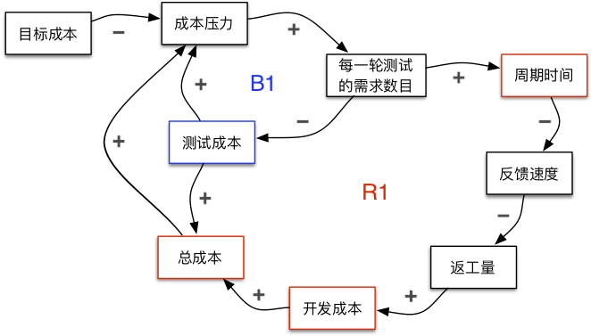
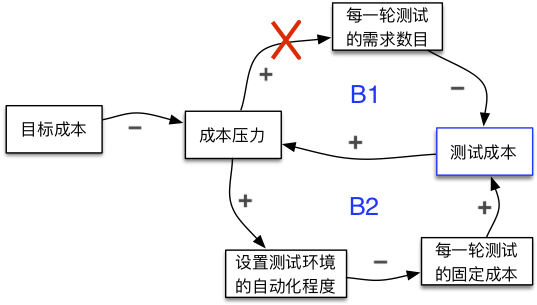
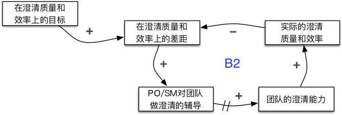
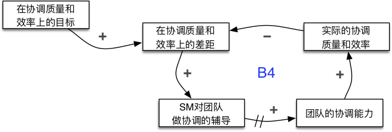
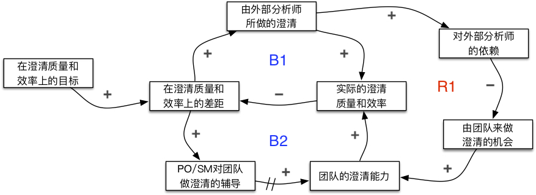
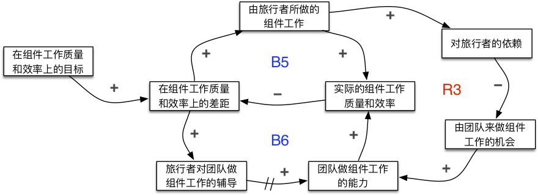

#第八章 理解组织变革

在探讨分析了工作、人员、时间和管理这四个方面的组织设计选择之后，接下来两章我们来关注组织变革过程。在这一章中我们将透过系统思考的视角理解组织变革过程，而在下一章中我们将应用系统思考分析一些具体实施组织变革的选择。

##1. 从变革阻力到成长上限

首先我们来理解在组织变革过程中常见的三个问题：

1. 变革在发起后就趋于停滞，因为变革阻力的存在；
1. 变革在“完成”后就趋于停滞，因为追寻目标的系统行为；
1. 变革在增长了一段时间后就趋于停滞，因为成长上限的动态。

###1.1 变革阻力

为什么变革会被抵制呢？有一个基本的平衡回路在起作用。

**B1回路**：变革被抵制以保持现状

开始时组织处于稳定状态，也就是目标和实际同为现状。有些人增加了变革努力，提高了实际，使得实际高于目标。这样一来差距加大，由此促发其他人的另一种“变革”努力，把实际向目标方向拉回（如上图中小箭头所示），从而减小差距。

这里的另一种“变革”努力就是常说的变革阻力，它只是把系统带回稳定状态的力而已。注意图中的变革努力是将实际拉离目标，而“变革”努力是将实际拉向目标。从系统的角度，它们都是变革的力，没有好坏之分。

在这种情况下，不要再施加更多的变革努力，那只会带来更多的变革阻力。一个杠杆解是通过提升目标来施加影响。正如我们随后会讨论到，当目标持续高于实际时，变革阻力就会消失。这也解释了为什么许多变革尝试以失败告终。没有共同的变革目标，身处组织的人们自然会努力保持现状。

###1.2 变革完成

一旦我们追寻的目标高于我们的现状，动态就发生了变化。

**B2回路**：变革被完成以达到目标

提升了的目标拉开了和实际的差距。变革努力开始起作用增加了实际，从而靠近目标（如上图中小箭头所示），使得差距减小。

这个平衡回路其实和B1回路并无不同，它们都在追寻目标。然而，因为B1回路中的目标是现状，所以我们看到的是变革阻力；而B2回路中的目标高于现状，我们看到的是变革动力，直到目标被达成为止。

当目标被达成后，变革就趋于停滞。目标状态变成了新的现状。我们如何能够往更好的状态继续变革呢？一个杠杆解还是通过提升目标来施加影响。

###1.3 增长变革

当最初的目标被达成后，我们再次提升目标以让变革继续增长。

**R1回路**：提升目标来增长变革

一旦通过B2回路让实际增加达到了目标（如上图第一个小箭头所示），我们就提升目标。现在B2回路再次起作用，直到新的目标被达成（如上图第二个小箭头所示），然后我们再次提升目标。这本质上就是持续改进。

理想情况下，我们希望一直将变革增长。然而，一段时间后变革还是停滞了，因为存在成长上限的动态。

###1.4 成长上限

为了改变实际，我们不仅需要努力，还需要能力。这里的能力包含各种各样，比如组织、技术、协作等等。

**B3回路**：能力短缺将限制变革增长

一旦目标被提升，需要的能力也相应增加。当现有能力是约束时，能力短缺将变大，从而限制了实际的增加。

R1回路和B3回路形成了“成长上限”的系统基模。为了让变革持续增长，一个杠杆解是通过构建能力来施加影响，而且这需要尽早做，因为它需要一个过程。在持续增长变革的过程中，各种约束都将暴露出来，但是在产品开发组织变革的上下文中，有些约束还是可以预测的。其中一个是技术能力的不足，不幸的是这在很多产品开发组织都能见到。这也是为什么比如LeSS就建议在组织重新设计之前几个月就先开始技术辅导，从而能在撞上它之前就将之缓解。

总结来说，为了能让变革一直持续，也就是形成持续改进，有如下几个主要杠杆解：

1. 创建共同的不满足现状的目标，从而避免变革阻力
1. 提升目标以增长变革，从而避免变革在“完成”后就趋于停滞
1. 尽早移除约束，从而避免变革在撞上限制时就趋于停滞

##2. 局部优化和系统优化目标

接下来我们来看局部优化如何产生，以及定义清晰的系统优化目标并用它来指导变革的重要性。

###2.1 局部优化

“一次测很多需求在成本上更高效。”这是个典型的局部优化，为什么我们这样做呢？

**B1回路**：一次测很多需求以节省成本

当有成本压力时，我们增加每一轮测试中包含的需求数目，以便减少测试成本。然后，成本压力得到缓解。

我们这样做是因为每一轮测试的固定成本很高，比如设置测试环境就有很多工作量。所以我们并不是故意局部优化，而只是想解决某个问题。

为什么它是局部优化呢？让我们拉远视线。

在左上角的是原先的B1回路，现在我们把更多变量拉进到图中。当我们增加每一轮测试中包含的需求数目时，最直接的影响是周期时间会增加。同时，由此带来的延迟反馈则会增加返工量，从而增加开发成本（这里我们区分了开发和测试，也就是总成本包含测试成本和开发成本两部分），总成本也会随之增加。这反过来又加大了成本压力，形成增强回路R1。

简而言之，增加每一轮测试中包含的需求数目所带来的“全局”效果是，一方面是增加了周期时间，另一方面则是虽然减少了测试成本，但却增加了开发成本，因此总成本也可能会增加。

这里其实有两类局部优化：

1. 减少成本可能增加周期时间。这引出以下问题 - 我们从整体上想优化什么？也就是什么才是我们的系统优化目标；
1. 减少测试成本可能带来总成本的增加。这反映出“优化部分未必优化全局”。

###2.2 系统优化目标

如果我们减少了成本但增加了周期时间，这是局部优化吗？在明确系统优化目标之前我们其实没法回答。如果我们的目标是成本效率，它可以是全局优化；但如果我们的目标是周期时间，它就是局部优化了。

系统优化目标应该被定义在我们的变革愿景中，否则我们就没有指导变革的坚实基础。这些年来最流行的组织变革应该是敏捷了，它又是为了什么优化？是为了敏捷和适应性，还有最大化客户价值和缩短周期时间；但并不是为了生产力、资源利用率、成本效率，等等。如果没有明确定义系统优化目标，我们的变革努力几乎注定要失败，局部优化会“自然”发生。

即使我们把周期时间设定为系统优化目标，一些人还是会对成本有顾虑。他们会说：“是的，周期时间是重要，但是我们也得考虑成本。每次测一个需求确实成本太高了，我们现在还是得把许多需求放在一起测。”其他人点头表示同意，然后大家就解散了。Craig Larman把这个叫做“失去立场”。

在组织变革中，我们需要清晰区分系统优化目标和次要关注。我们不能以牺牲系统优化目标为代价来解决次要关注；次要关注需要用其它方式解决。

在我们的例子中，这意味着应该打破B1回路，而引入一个替代的B2回路来解决成本顾虑。

**B2回路**：减少每一轮测试的固定成本

当有成本压力时，我们增加设置测试环境的自动化程度，以便减少每一轮测试的固定成本，从而减少测试成本。然后，成本压力得到缓解。

总结来说，为变革设定清晰的系统优化目标非常重要，它能帮助我们辨别各种局部优化。在此基础上，我们要采用不损害系统优化目标的方式来解决次要关注。

##3. 从生存需要到舍本逐末

我们已经约定了变革愿景，并且在常态期间也能取得进展，然而当危机降临时我们又失去了立场。

###3.1 在常态期间

在变革愿景和现实之间总存在差距，这是意料中的。

比如，我们展望特性团队能够：

* 直接与用户和干系人澄清需求
* 自组织来协调工作
* 跨组件地来开发特性

然而，现实却是：

* 特性团队自己做澄清的质量和效率低下
* 特性团队自己做协调的质量和效率低下
* 特性团队自己做某些组件工作的质量和效率低下

建议的长期解决方案是：

* 通过PO和SM的辅导来构建团队自身的澄清能力（**B2回路**）
* 通过SM的辅导来构建团队自身的协调能力（**B4回路**）
* 通过旅行者的辅导来构建团队自身做某些组件工作的能力（**B6回路**）

注：旅行者被安排来帮助特性团队增加对某些组件的知识

在常态期间，我们能取得一些进展，但是它还不足以填补差距。然后我们就撞上了危机。

###3.2 在危机期间

在危机期间，我们的生存需要增加了。我们寻求速效方案，因此：

* 重新引入分析师角色，冠以团队PO、特性负责人之类的称呼。本质上之前的业务分析师角色回来了（**B1回路**）
* 重新引入协调者角色，冠以特性经理、特性协调者之类的称呼。本质上之前的项目经理角色回来了（**B3回路**）
* 重新定义旅行者角色，让他把相关组件的工作直接做了。本质上传统项目管理中的动态资源分配回来了（**B5回路**）

要是它们只是临时方案就好了！

不幸的是，随着时间的推移，我们上瘾于借助：

* 外部的分析师（**R1回路**）
* 外部的协调者（**R2回路**）
* 外部的旅行者（**R3回路**）

我们在所有这些中都看到了“舍本逐末”的系统基模。

变革愿景就此迷失：

* 团队再未能真正跨职能
* 团队再未能真正自组织
* 团队再未能真正跨组件

---

对“舍本逐末”来说，杠杆解存在于两个方面。

1. 在常态期间，我们要增加长期方案 - 通过辅导和教授来构建团队能力 - 的有效性。因为它是长期方案，我们经常会失去紧迫感和专注力。我们可以把长期目标分解成子目标，并且设定时间表来达到这些子目标。
1. 在危机期间，我们首先要挑战自己 - 这真是生死之际吗？即使答案是肯定的，我们也要确保采用速效方案只是为了赢得时间。为了避免上瘾，我们可以在角色的名字上显式加上“临时”，并且设定明确的时限来让临时角色过期。

留心生存需要是如何摧毁我们的变革努力的！

##总结

在这一章中，我们透过系统思考的视角来理解组织变革过程。

无论是变革动力还是变革阻力其实都是平衡回路在起作用，理解了这一点，设定合适的目标并动态调整是增加动力和减少阻力的关键。

我们希望的变革过程是一个持续改进的增强回路，但是在过程中会遇到各种各样的阻碍，使得增强回路难以为继。这其实就是“成长上限”系统基模的动态。如何消除平衡回路带来的抑制是保持变革持续向前的关键。

复杂系统中的因和果经常在空间和时间上相距甚远，这导致了大量的局部优化和短期优化。我们需要把视线拉远才能看到全局，把视线拉长才能看到长期。明确系统优化目标，以避免为局部的次要关注而失去全局的立场。明确长期愿景和设定速效方案的时限，以避免为短期的生存需要而失去长期的立场。