#第九章 实施组织变革

在上一章中我们透过系统思考的视角理解了组织变革的一些方面，我们在这一章中将应用系统思考分析一些具体实施组织变革的选择。

##1. 简化组织的最好时机

我们先来讨论在大规模产品开发组织中的一个具体变革：简化以扩大组织。它意味着通过简化组织来获得敏捷性，这也是LeSS的核心思路。简化组织的一个方面是减少角色，因为越多角色导致团队越不担责。

然而，当组织扩大时，越来越多的角色是个螺旋坠落。其中最主要的角色是经理和专家。我们来分别看它们背后的动态。

###1.1 越来越多的经理

苏斯博士[《幸运的家伙》](https://www.amazon.cn/dp/0007173121)书中描绘的看蜂人是对越来越多经理的最好注解，他们确实可以一直增长！

这种自我增强的特性呈现在以下动态中。

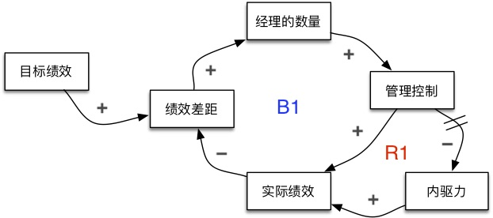

**B1回路**：加强管理控制以获得更好绩效

当发现绩效差距时，我们增加更多经理以加强控制，从而提升实际绩效，使得绩效差距缩小。

**R1回路**：管理控制减少动力从而降低绩效

然而，当我们加强了管理控制，真正工作人员的内驱力却逐渐降低，进而降低实际绩效。作为响应，我们引入更多经理和更多控制。

B1/R1回路形成“饮鸩止渴”系统基模的动态。我们进入了经理越来越多的螺旋坠落。

当组织扩大时，有更多的经理就更为自然了。让我们来看以下动态。

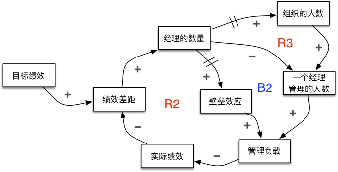

**B2回路**：增加经理数目以降低管理负载

当组织扩大时，每个经理管理的人数变多，导致管理负载变高。这带来了实际绩效的降低和绩效差距的变大。作为响应，我们增加更多经理，使得每个经理管理的人数变少。这样就降低了管理负载，从而提升实际绩效，缩小绩效差距。

**R2回路**：经理们产生壁垒

经理越多，他们之间产生的壁垒效应也越强。壁垒效应是指每个经理为了管理控制和应对问责各自强化自己的边界，相互之间逐渐形成壁垒。这又导致管理负载增加，实际绩效降低。作为响应，我们引入更多经理。它是个自我增强的过程。

**R3回路**：经理们招人

经理越多，他们招的人也倾向于越多。从而组织进一步扩大，每个经理管理的人数又变多了。这导致管理负载再次增加，实际绩效降低。作为响应，我们引入更多经理。它也是个自我增强的过程。

B2/R2回路和B2/R3回路都形成“饮鸩止渴”系统基模的动态。我们进入了人员和经理都越来越多的螺旋坠落。

###1.2 越来越多的专家

当组织扩大时，我们也会有更多专家。让我们来看以下动态。

**B3回路**：细分专业以降低能力要求

当发现能力缺口时，我们细分增加专业数目，从而有更多专家。这降低了对每个人的能力要求，使得能力缺口缩小。

**B4回路**：增加学习以改善实际能力

当发现能力缺口时，我们增加学习，逐渐改善我们的实际能力，使得能力缺口缩小。

B3/B4回路形成“目标侵蚀”系统基模的动态。因为B4回路含有更多延迟，所以B3回路会占主导。我们会有越来越多的专业和专家。你可以从[“过度专业化和浪费潜能”](https://yihuode.io/articles/313)中了解更多关于该动态。

**R4回路**：专家产生人员缺口

当专家只是工作在他们的专业时，变化的需求会逐渐在不同专业产生人员缺口。人员缺口触发招人或移人到该组织，从而使得组织进一步扩大。组织越大，细分专业越多，专家越多。这又是个自我增强的过程。你可以从[“为什么产品开发团队越变越大”](https://yihuode.io/articles/302)中了解更多关于该动态。

我们进入了人员和专家都越来越多的螺旋坠落。

---

简化组织意味着有更少的角色 - 更少的经理和专家。当组织扩大时不增加经理和专家，这可能吗？是否有其它路径？

不是更多经理，而是：

* 设计成自组织特性团队，让团队承担更多职责来交付端到端的客户价值，使得经理的负载变低；
* 提升经理在教授和辅导上的能力。

不是更多专家，而是：

* 设计成具备多专业技能的产品开发者，让他们来适应变化的需求，使得整个组织人员缺口变小；
* 提升交叉学习的有效性。

螺旋坠落是一条路径，而简化以扩大组织是另一条路径。简化组织的最好时机在哪里呢？曾经有一个客户让我帮助扩大他们的产品开发组织，使其能保持敏捷。那个时候，他们还是20人左右的规模，但是准备扩大到50-100人。他们处于十字路口，这是简化组织的最好时机。

是的！简化组织的最好时机是在它规模还小，还没有那么多角色的时候。

##2. 工作安全而非角色安全

如果已经身处大规模，已经有了很多角色，那么我们将面临更大的挑战来应对现有角色，尤其是经理和专家。我们接下来讨论在那些特殊角色已经存在的情况下如何减少它们。

###2.1 没有角色安全

我们通过减少特殊角色来让团队承担更多责任，从而增加组织的适应性。然而，这样的举措在特殊角色人员中产生了不安。各种顾虑被提出来以阻止该变化。由于那些顾虑经常也是有一定道理，这些特殊角色又被保留了，变革就此停滞不前。

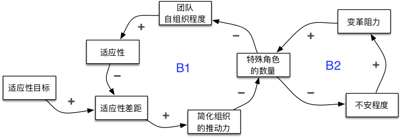

**B1回路**：减少特殊角色以增加适应性

为了弥补在适应性上存在的差距，我们加大简化组织的推动力，从而减少特殊角色的数目。这样做增加了团队自组织程度，由此提高了适应性，最终得以达成在适应性上的目标。

**B2回路**：增加特殊角色以减少不安

减少特殊角色带来了不安，由此变革阻力增加了，然后那些特殊角色得以保留。

我们应该问一下我们的系统优化目标是什么。如果是适应性，但是我们在解决不安时却牺牲了它，我们在失去立场，就象我们在“局部优化和系统优化目标”文章中描述的那样。不安是次要关注，它需要通过另外的方式去解决。

LeSS的其中一个指南叫“工作安全而非角色安全”。经理和专家不应有角色安全，我们不应只是为了让他们感到安全而保留那些特殊角色。

十多年前我还在诺基亚网络工作时，我所在的组织经历了一次大的重新设计，其中一个变化是项目管理部被解散了。作为一个项目经理，我当时很清楚在新的组织里将不会再有项目经理的角色，所以已经准备好了离开。然而，尽管没有了角色安全，我们仍有工作安全。组织尽力帮助被影响的人调整。幸运地是 - 回想起来算是一个改变生命的时刻 - 我转换了角色留在了新的组织中。

不可避免有些人会选择退出，而我们应该关注那些选择留下接受改变的人，并帮助他们度过难关。

###2.2 生存焦虑和学习焦虑

Edgar Schein在他的经典书籍[《企业文化生存与变革指南》](https://www.amazon.cn/dp/B01MZ4S104)中引入了两个概念 - 生存焦虑和学习焦虑。它们是两种不同类型的不安。

生存焦虑指的是感到“如果你不以某种方式响应，会有坏事情发生在你身上”的不安。它带来改变的动力，是驱动变革的力量。

学习焦虑指的是感到“要求你的新行为也许难以学会，隐含的新信念或价值观也许难以接受”的不安。它带来改变的阻力，是抑制变革的力量。

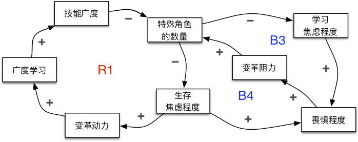

**R1回路**：生存焦虑带来变革动力

减少特殊角色增加了生存焦虑。这会提升改变动力，由此促进广度学习，带来技能广度的增加，从而可以进一步减少特殊角色。

**B3回路**：学习焦虑带来变革阻力

减少特殊角色也增加了学习焦虑。这会增加畏惧感，由此带来改变阻力，以保留那些特殊角色。

**B4回路**：生存焦虑带来变革阻力

尽管生存焦虑提升了改变动力，它也会增加畏惧感，由此带来改变阻力，以保留那些特殊角色。

以上动态也反映在关于生存焦虑和学习焦虑的两个原则中：

1. 生存焦虑必须大于学习焦虑
1. 必须降低学习焦虑，而不是增加生存焦虑

真正的杠杆解是通过提供心理安全来降低学习焦虑。其中两个最重要的方面是：

1. 工作安全，以使人有时间和空间进行学习和调整
1. 学习支持，以使人能有效地进行学习和调整

---

总结而言，当我们不得不去除一些特殊角色时，我们将以尊重人的方式进行。

* 工作安全而非角色安全。清晰并坚定地沟通变革相比模糊信息是更尊重人的方式；
* 承认有些人不会接受变化而会退出，尊重他们的决定；
* 为那些决定留下接受变化的人提供强有力的支持，从各方面帮助他们学习和调整。

##3. 结构变革的范围

我们将在这节和下节里讨论结构变革的话题。我们先来看结构变革的范围 - 多大范围的结构变革合适，在这个选择里有哪些因素和动态。

###3.1 结构是一阶因素

下图来自Richard Hackman的经典书籍[《Leading Teams》](https://www.amazon.com/Leading-Teams-Setting-Stage-Performances/dp/1578513332)，其中展示的团队绩效、团队设计和辅导之间的关系极具洞察。结构和辅导都对团队绩效有影响，但相比之下结构起到更大的作用。

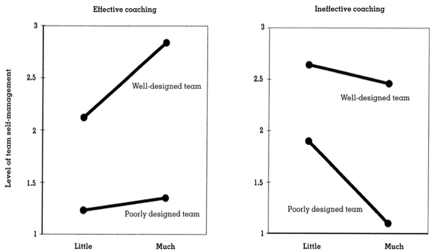

这个关系也体现在变革中常见的“成长上限”系统动态里。

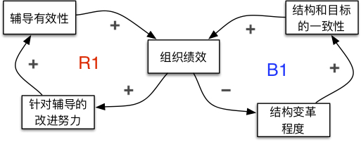

**R1回路**：辅导出绩效

我们在现有的组织结构下改进辅导的有效性，从而提升组织绩效。好的结果又促发对辅导进一步改进，由此形成良性循环。

**B1回路**：结构限制绩效

目前的结构成为提升组织绩效的限制，因为它与组织优化目标并不一致。当组织绩效高时，结构变革就小。这样一来它和目标的一致性依然很低，最终限制了组织绩效的增长。

“成长上限”系统动态的杠杆解在于打破平衡回路，最好是在早期。这意味着尽早考虑结构变革。

###3.2 结构一致性与稳定性

假设目前的结构和我们的变革目标并不一致，我们需要增加结构和目标的一致性以使变革成功。

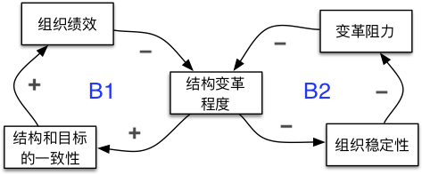

**B1回路**：结构变革增加一致性

当结构限制了组织绩效的增长，我们做出更多的结构改变，从而使得结构和目标更为一致。结果是，组织绩效得到了提升。

**B2回路**：结构变革打破稳定性

结构变革越多，组织稳定性越差，希望减少结构改变的阻力就越大。

这在结构变革涉及消除现有角色时更是如此。它威胁到了心理安全。这是为什么确保工作安全而非角色安全至关重要，如上一节“工作安全而非角色安全”中所述。

在这里结构一致性是系统目标，而组织稳定性是次要关注。我们改变结构来优化一致性，而用其它方式来解决对稳定性的顾虑。

###3.3 结构变革的范围与时期

那么，多大范围的结构变革合适呢？让我们先来理解都有哪些可能的结构变革范围。

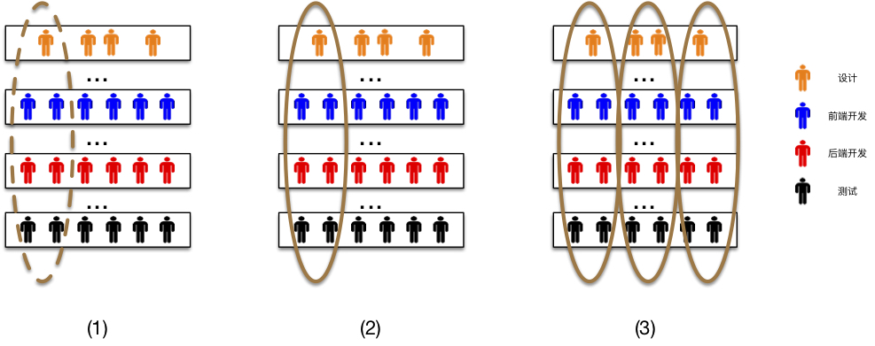

1. 没有结构变革。在传统的项目设置下，项目组是临时以虚拟的方式创建的。它在本质上并没有结构变革。
1. 涉及一个团队的结构变革。这一个团队是创建之后永久存在的，汇报线也相应地改变；而其它团队仍处在老结构下。这样就存在并行组织，一部分处在老结构下，而另一部分处在新结构下。
1. 涉及所有团队的结构变革。所有团队都一起被创建，从而整个组织都处在新结构下。

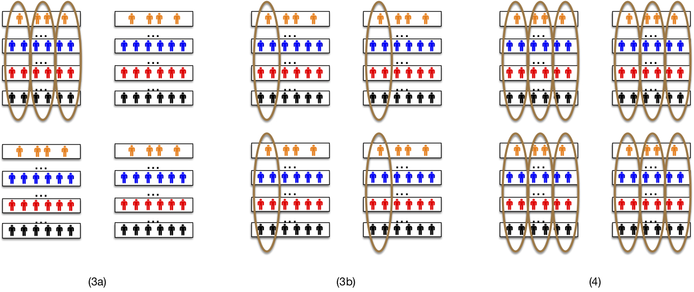

当这个组织非常大时，有很多团队在很多领域，我们可以采取中间的步骤来改变多个团队的结构 - 比一个团队要多而比所有团队要少。这多个团队可以是（3a）那样一个领域的所有团队，也可以是（3b）那样每个领域各一个团队。我们还可以一起改变所有领域的所有团队，如（4）所示。

总结下来，我们可以把结构变革的范围定义成一个变量，从（1）最小到（4）最大。

1. 没有结构变革
1. 一个团队结构变革
1. 多个团队结构变革
1. 所有团队结构变革

结构变革的范围也会影响它发生的时期，也就是完成整个变革的时间长度。想象一个20个团队规模的组织。如果你每次结构变革只创建一个团队，每次变革范围都很小，但整个变革时期就会很长。如果你一起创建所有团队，变革范围很大，但变革时期却很短。

大的变革范围会增加变革的复杂度；长的变革时期也会增加变革的复杂度。有以下两个主要原因：

1. 它对组织纪律性的要求更高，需要组织在较长的变革时期一直能聚焦向前。在更长的时期内会有更多的危机出现，当处于危机时短期思考可能会占上风，从而形成舍本逐末的动态，如“8.3 从生存需要到舍本逐末”章节中所述。
1. 让并行组织良好运作是有挑战的，因为同一组织的不同部分采用的运作方式并不一致，容易引起混乱。处在过渡状态的时间越长，经历的痛苦也会越多。

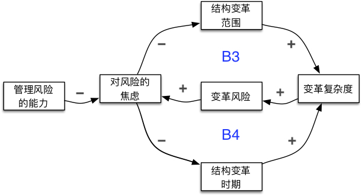

**B3回路**：缩小变革范围以降低风险

当因为高风险而焦虑时，我们会缩小结构变革范围，以降低变革复杂度，从而降低变革风险。

**B4回路**：缩短变革时期以降低风险

当因为高风险而焦虑时，我们会缩短结构变革时期，以降低变革复杂度，从而降低变革风险。

由此可见，我们需要在变革范围和变革时期之间有所平衡。

LeSS建议的变革范围并非是一个团队，而是多个团队。如果组织规模在8个左右团队之内，建议一次性改变所有团队的结构；如果组织规模超过8个团队，建议采取增量式地变革。这是LeSS就一次改变多少结构合适所做的选择。

##4. 增量式结构变革

当组织规模很大时，采用增量式结构变革通常更为合适。我们来深入讨论如何做增量式的结构变革，我们来看增量式结构变革的不同方式。

###4.1 两种方式

增量式结构变革主要有两种不同的方式。为了方便解释，我这里会参照LeSS术语，但背后的思考超越了LeSS，可以应用于一般的增量式结构变革。

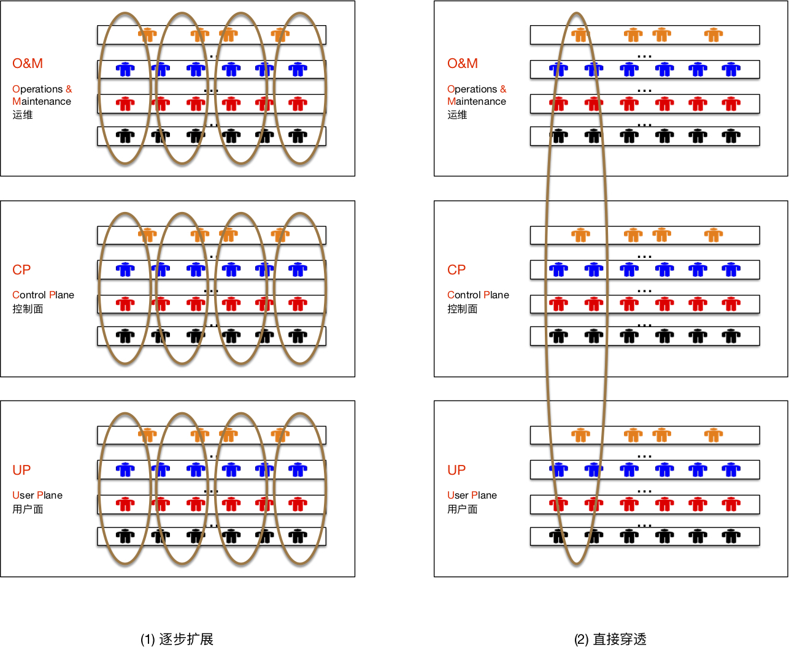

上图呈现了将这两种方式应用在一个典型的电信产品上。产品由三个主要的子系统组成 - 运维（Operations & Maintenance）、控制面（Control Plane）和用户面（User Plane）。在每个子系统里都有一些组件。在我们开始变革之前，所有的团队都是围绕组件和职能组织的。变革愿景是所有团队都将跨职能和跨组件，也就是所有的团队最终都将是特性团队。我们将如何做增量式的结构变革呢？

（1）逐步扩展

这是LeSS指南[“特性团队导入地图”](https://less.works/less/adoption/feature-team-adoption_map.html)的方式。我们首先扩展组件团队的范围，以让它更接近特性团队。对每个子系统，我们进行结构变革以创建子系统内部的“特性”团队。这样的扩展在所有子系统里并行发生。

（2）直接穿透

这是LeSS指南[“一次一个需求领域”](https://less.works/less/less-huge/huge-adoption.html)的方式。我们直接穿透所有的子系统来创建第一个需求领域，包含若干真正的特性团队。同时，组织的大部分还是保留原先的结构。

这两种方式既有相同又有不同。

###4.2 相同的

它们都是增量式结构变革，因此都只是实现变革愿景的第一步。如上一节“结构变革的范围”中所述，我们通过限制变革范围来降低复杂度；但是它也拉长了变革时期，反而使得复杂度增加。所以这是一个平衡。

对增量式结构变革有两个挑战。

1、初始的成功很关键，因为这里存在一个增强回路。

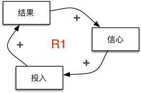

**R1回路**：结果说话

更好的结果，更强的信心、更多的投入，带来甚至更好的结果。注意它在另外一个方向也成立。更差的结果，更弱的信心，更少的投入，带来甚至更差的结果。

这可能对任何变革来说都是最根本的动态。我们必须获得初始的成功来让结果说话。这一点对两种方式都适用。

2、变革在初始的成功后可能停滞不前，如“8.1 从变革阻力到成长上线”中所述。为了增长变革，我们必须在初始的成功之后立刻设定下一个目标，直到组织结构变革愿景完全被实现。

###4.3 不同的

为了获得初始的成功，这两种方式做了不同的权衡抉择，如下表所总结。

| | (1) 逐步扩展 | (2) 直接穿透 |
| :---: | :--- | :--- |
| **组织** | 子系统内的“特性”团队；对当前组织较少破坏性，因为基于子系统的组织依然存在；（有限的）影响会立刻涉及到所有人；没有并行组织 | 真正的特性团队；对当前组织更具破坏性，因为它穿透了整个组织；基于自愿；存在并行组织 |
| **客户价值** | 依然需要多个团队才能交付特性，存在跟组件团队同样的动态和问题，但程度更轻 | 重组的每个团队都能端到端地交付特性，从而每个迭代都有客户价值交付 |
| **学习** | 学习是更渐进的 | 立刻需要更广范围的学习 |

让我们来展开更多细节。

1. 组织

	我们只有采用第二种方式时才有真正的特性团队。这个变化对当前组织来说更具破坏性，因为它穿透了整个组织。但它不是立刻就影响到所有人，而是初始的变革基于自愿的原则。

	第二种方式也会带来并行组织，一个需求领域会以新模式工作，而其它部分则保持旧模式。这增加了变革管理的复杂度。

1. 客户价值

	在第二种方式中，单个团队都能在每个迭代交付真正的客户特性，而子系统内的“特性”团队依然需要协调并集成它们的工作到一起才能实现客户价值交付。本质上来说，子系统内的“特性”团队仍然是组件团队，所以组件团队相关的动态和问题依然存在，但是程度会更轻。

1. 学习

	在第一种方式中从一个组件到一个子系统的学习扩展是更渐进的，而在第二种方式中通常立刻就需要更广范围的学习。如果团队成员过去一直狭窄地聚焦于小的组件，广泛学习对他们可能会是一个大的挑战。

---

总结来说，两种方式都是增量式的，因此具备一致的基本思路和动态。然而，它们为获得初始的成功做了不同的权衡，从而采取了不同的第一步。

##总结

在这一章中，我们就两个在大规模产品开发组织实施变革过程中重要的问题做了分析。

一个是简化组织，通常它涉及到减少角色。我们发现最好的时机是在组织还没有变大、还没有引入很多角色的时候。这意味着更早时候就要考虑如何扩展组织的问题，对组织愿景（一个简化的组织，即使人员规模很大）形成共识，有意识地一步步走近愿景。如果我们已经错过了这个时机，也就是现在的组织已经复杂化了，并已有很多角色（尤其是经理和专家）存在，简化组织的关键是确保工作安全，而非角色安全，对受变革影响的人员予以尊重，尽力帮助他们完成转变。

二是进行结构变革多大范围合适。当组织规模大到一定程度时，一步到位完成所有结构变革会过于困难，而增量式结构变革更为合适。增量式结构变革也有不同的方式，我们介绍了逐步扩展和直接穿透两种方式，以及背后的权衡和动态。

如果大规模产品开发组织以快速交付有价值的产品为系统优化目标，简化的组织结构（没有多余角色，团队承担更多责任，能够端到端地交付客户价值）更能支持这一目标。不幸的是，我们现有的组织通常是与简化组织背道而驰的；处理好角色的简化、增量式地改变组织结构是成功变革的两个关键。
